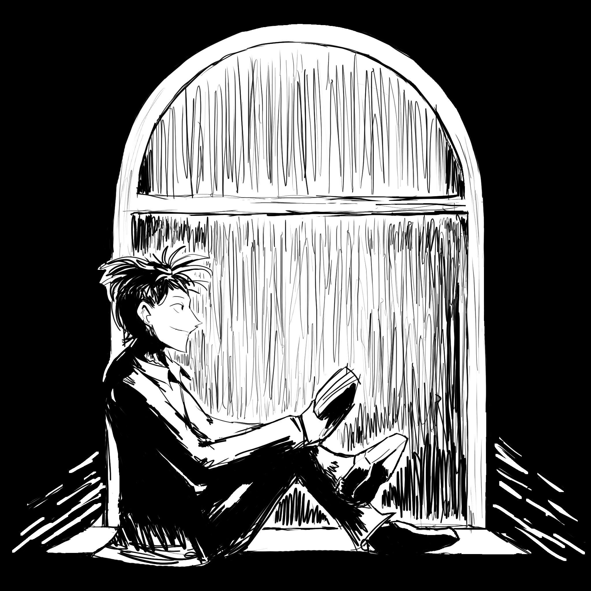

---
tags:
  - sketch
  - vicerre
---

# Rendition 001 – Windowsill (2023-05-24)

## Overview

I've always wanted to practice drawing entire scenes instead of just characters, so I worked that into a scene I wanted to share with Vicerre! That being said, I wanted to start simple given my lack of experience, so I went with a black and white manga-esque sketch.

## Design notes

For this sketch, I drew Vicerre reading a book in front of a windowsill on a rainy day. I wanted to portray a cozy and slightly melancholic mood. The framing of it is very symmetrical, since I felt like that lessened the work I'd have to put into making the scene work from a more dynamic perspective while practicing other skills.
