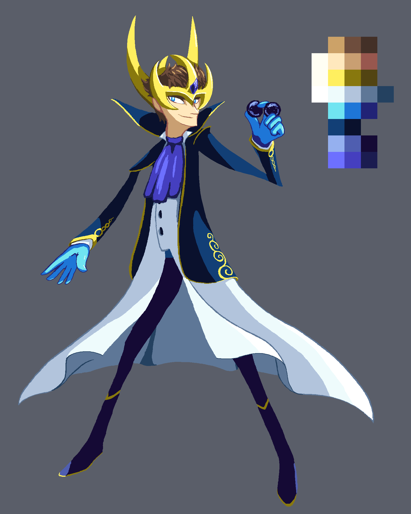

---
tags:
  - concept art
  - costume design
  - fanart
  - fan art
  - persona 5
  - vicerre alt
---

# Rendition 002 – Phantom Thief (2021-06-29)

## Overview

I've been following [Darquezze's](https://twitter.com/Darquezze306) _Persona 5_ stream for the past few months, and that's been an inspiration for art. I've found that the motifs and designs used in _Persona 5_ fit the themes used in Vicerre's story well, and Darquezze inspired me to try drawing him in the _Persona 5_ style. I took that as an exercise for costume design by drawing what he could have when in the Metaverse. I've mainly drawn Pokémon designs before, and while I have drawn human designs in the form of gijinka, I haven't done too much in costume design in general! Vicerre in particular is someone that I haven't had too much experience designing fancy costumes for, given his home universe.

## Design notes

In order to design a fantasy-inspired outfit, I referenced the supernatural elements associated with him. For instance, I've always associated Vicerre with the Pokémon Alolan Ninetales, so that would normally be a good inspiration. However, the concept of an ice-wielding, fox-themed Metaverse user was already taken, so I turned to other ideas.

The first issue is what his mask would look like. I went through several ideas for that. For instance, as he comes from a scientific background, I thought it could be fun to push at the "mad scientist" angle, so I thought about designing some sort of chemistry visor. However, I felt like it wouldn't evoke other parts of Vicerre's personality enough, so I drew other ideas. Specifically, I wanted to make the mask look jagged as an indicator for his prickly personality. I got some inspiration from Marvel's design for Loki and drew a golden crown thing, which also alludes to his proud personality.

With that decided, I started filling in the outfit. As an extension of the above, I wanted it to be a synthesis of a "royal" appearance with a "scientific" appearance. While Vicerre specializes in genetic engineering, I've never placed him in the stereotypical white labcoat before, so this seemed like an excellent opportunity to do so unashamedly. Fantasy elves and vampires, being commonly associated with "noble" and "elite" classes in stories, were also an inspiration for the design of his jacket. Darquezze streaming _Genshin Impact_ also was a motivation for the jacket's gold trim. Then there's the ascot/cravat thing that ties the two layers together. That was inspired by the designs of Ansem's apprentices in _Kingdom Hearts: Birth By Sleep_.

Originally, I drew this piece starting with outlines, but I found it hard to figure out how to color it. I ended up scrapping the original sketch and redrew it starting from colors. I was able to get a lot farther in the drawing this way, and I thought I had a more unique art style using this technique, so I went with that attempt!

I went with blue as a primary design color. Blue is associated with ice, and blue lighting is often used to make a room feel artificial instead of natural, which both play into his character. "Royal blue" is also a color that thematically works with the costume motif. Lastly, blue accents Vicerre's icy blue eyes. The rest of the colors fell into place afterward. Gold and purple were natural picks for royal colors, and white is clinical and sterile.

The patterns of the gold trim weren't inspired by anything in particular. I originally tried having them be angular and crystal-like like ice, but those attempts reminded me of lightning bolts and reptile scales, so I changed them into generic swirls.

Towards the tail end of the render, I sketched the outfit from a side angle, which made me realize that the silhouette of the outfit from the side angle could be made more interesting. I wasn't sure about giving the outfit actual horn-like protrusions, since I thought it was too on-the-nose, and it would resemble Loki's or Hela's designs from Marvel Comics too much. However, after I had nailed down the rest of the design, I could add this design element without fear.

I forgot that Phantom Thief outfits had a theme color expressed through the color of their gloves until the very end of this drawing. That wasn't too hard to add in, though. Light blue gloves fit Vicerre's design elements and evoke latex hospital gloves, which works well enough.

I probably could push the character design some more if I really wanted to give him a protagonist vibe, but I'm pretty satisfied with where I got to!

## Miscellaneous notes

- You might have noticed that Vicerre is holding something in his left hand you may not know. Vicerre officially calls them "Vector Reversers". In practical terms, though, they're time rewinders. They naturally repel each other like magnets of the same charge, but the longer you hold them close together, the longer they will rewind time. Despite this ability, this device is less powerful than it might seem. Vicerre has no special immunity against his memories being unwound if he uses the reversers—all he can do is infer why his future self may have wanted to use them in the first place and experiment with how he might change the outcome of the future, which in turn loses him some time. That being said, for any story to continue past the rewound time, one of the futures must involve him not using the reversers in one way or another.
- If my character were a part of the Phantom Thieves, he'd need a codename. This is something I've discussed with Darquezze about! A lot of the Phantom Thieves codenames are pretty literal (e.g., Skull has a skull mask and Fox has a fox mask), so I was thinking about names like "Crown", "King", or "Prince". However, I felt like names like these belied Vicerre's personality, and besides, the Phantom Thieves already had a "Queen", and I wanted to avoid overlap. After a bit of discussion, I thought that "Virus" made sense considering his role. In one of his story arcs, he was responsible for unleashing a deadly virus, and it fits nicely with his pre-character development personality as a detached and unstable individual.

## WIPs

- [1](https://cdn.discordapp.com/attachments/331457840231219201/853828859148894208/Temporary_File.png)
- [2](https://cdn.discordapp.com/attachments/331457840231219201/853828859148894208/Temporary_File.png)
- [3](https://cdn.discordapp.com/attachments/331457840231219201/855986260359250000/Temporary_File.png)
- [4](https://cdn.discordapp.com/attachments/331457840231219201/855993527893098496/Temporary_File.png)
- [5](https://cdn.discordapp.com/attachments/331457840231219201/856279599154200606/Temporary_File.png)
- [6](https://cdn.discordapp.com/attachments/331457840231219201/856326064753475614/Temporary_File.png)
