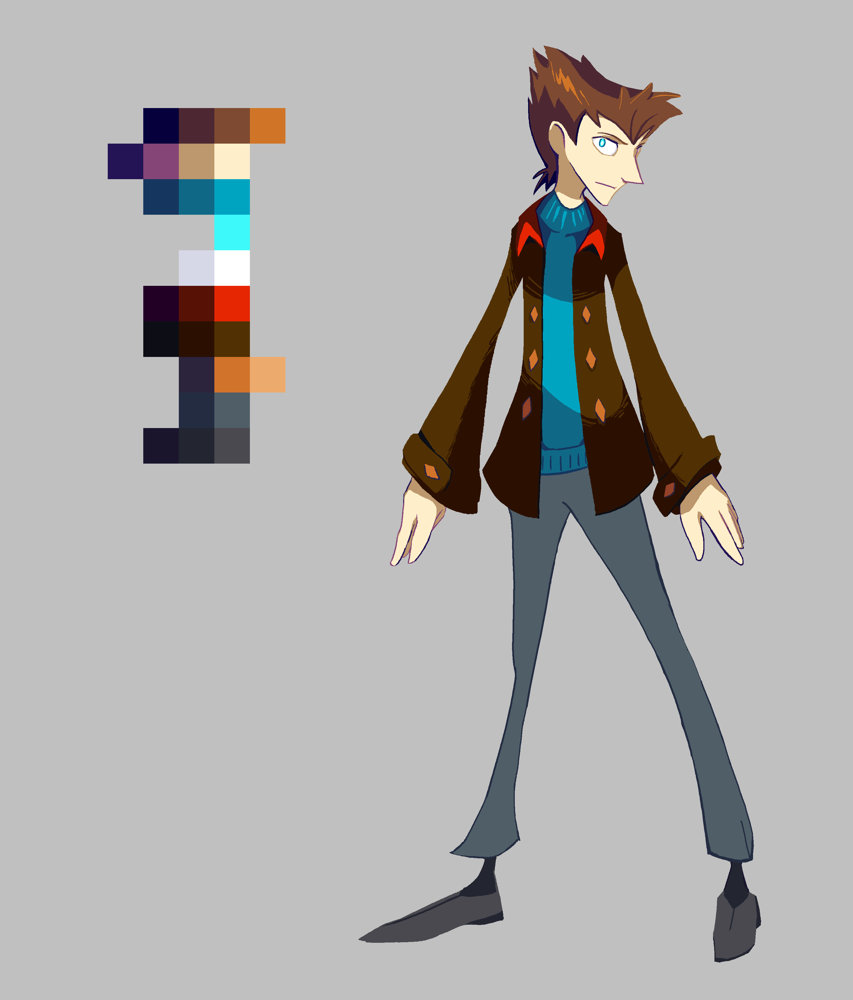

---
tags:
  - concept art
  - vicerre
---

# Illustration 001 – Armin Vicerre Reference (2021-06-30)

## Overview

I've always itched to improve upon Vicerre's costume design, but it's only until recently had I the motivation, visual acumen, and ability to build atop his original design.

## Design notes – Previous Design

How Vicerre's original character design reflected his character:

- I've always associated pre-character development Vicerre with icicles—bitterly cold and prickly.
- His shape language includes a lot of sharp angles, most prominently in his head shape. (Admittedly, it would be more visible if I offered a point of comparison.)
- As a serious sort of character, he prefers subdued colors.
- Vicerre wasn't one for aesthetics, so something simple, clean, and practical was more his style.

Breakdown:

- Head
  - Hair color: Brown to represent the mundane and practical
  - Hair shape: Angular to indicate prickliness, unkempt to indicate disorder
  - Head shape: Angular to indicate prickliness
  - Eye color: Icy blue to indicate iciness
  - Eye shape: Owl-eyed to make him look observant
  - White pupils: This is the one "unusual" design trait to indicate he's not an ordinary human character. It makes him look unsettling once you notice that it's not a stylistic embellishment.
- Skin tone: Slightly pale to indicate that he doesn't go outside much.
  -Body
  - Body shape: Lean and angular to indicate prickliness
  - Jacket design: Reflects his preference for cold weather. It's also slightly refined as a nod to his conceit
  - Jacket design (cont.): I've always been fond of how flared longcoats enlarge a character's silhouette, which can act as a visual metaphor for someone appearing larger than who they really are. However, a true longcoat seemed impractical in Vicerre's setting, so it became a regular jacket!
  - Jacket color: Brown to represent the mundane and practical
  - Other clothing colors: Subdued hues to represent the mundane and practical, blue to tie the design to ice and for contrast

Inspirations include:

- The Tenth Doctor (_Doctor Who_)
- The Medic (_Team Fortress 2_)
- Vexen (_Kingdom Hearts_)

## Design notes – Current Design

The evolution his character design can be seen as an evolution of his character. By this point, he's outgrown many of his previous character traits, and in general, he's much more sympathetic.

- He's more ice cream than ice now. He warmed up to other people, and there's a sweet side to him.
- He's finding more things to enjoy about life than the dim worldview he previously held, which includes an appreciation for the things he previously considered frivolous.

Breakdown:

- Jacket collar color: Added an expressive red color. Also indicates that he's still dangerous. Also adds contrast.
- Jacket cuffs: Adds detail to silhouette, also aesthetically interesting
- Jacket buttons: Expressive orange color. Also used to show body orientation. Also adds contrast.
  -Turtleneck: "Cozier" design element beneath the jacket while still alluding to his preference for cold weather.

Inspirations include:

- Goro Akechi (_Persona 5 Royal_)
- Looker (_Pokémon Diamond and Pearl_)

## WIPs

- [1](https://cdn.discordapp.com/attachments/331457840231219201/857828715660967946/Temporary_File.png)
- [2](https://cdn.discordapp.com/attachments/331457840231219201/858412727830839326/Temporary_File.png)
