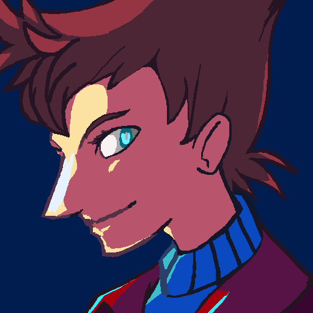

---
tags:
  - headshot
  - icon
  - profile icon
  - vicerre
  - vicerre ref
---

# Rendition 003 – Profile Icon (2021-07-01)

## Overview

(This image is designed to be viewed at 1/4 resolution, at a size of 128x128.)

The last drawing I have for this initial round of updates is the initial profile icon for this account! Originally, I originally intended on using a cropped version of the _Windowsill_ image as my first icon, but I thought I could draw something more with more substance.

## Design notes

I wanted to give the icon a subtly sinister feel quality to it, so:

- I used blue lighting to indicate his inclination towards the artificial, mechanical, and scientific, in contrast to "natural" yellow sunlight.
- I framed his face in shadow, which casts him in a sinister light. In addition, the shadow emphasizes those eerie blue eyes of his.

Overall, it was a fun exercise in using colors to set the mood for a piece.

## WIPs

- [1](https://cdn.discordapp.com/attachments/331457840231219201/858808003150872606/unknown.png)
- [2](https://cdn.discordapp.com/attachments/331457840231219201/858830844646260736/unknown.png)
