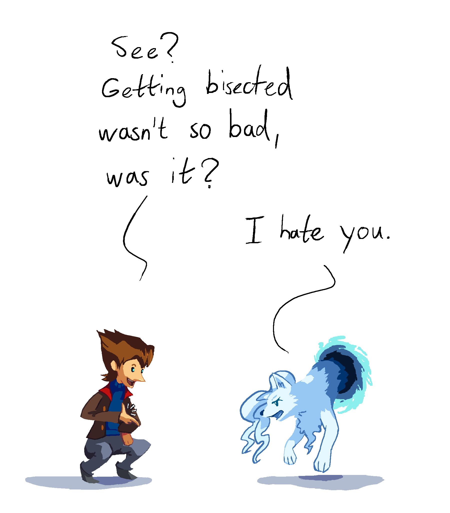
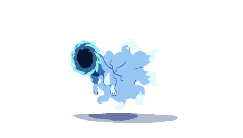

---
tags:
  - portals
  - vicerre
---

# Elucidation 001 – Portals

## Overview

One of the abilities Vicerre received from the Dream World is the ability to create portals. As often seen in pop culture, this ability has a wide range of uses, such as:

- Bag of holding: When you have a portable hole, you can always store as much as you need if you own an empty room.
- Heavy lifting: Portals can be used in lieu of physical strength for moving objects around, letting gravity do the work.
- Momentum: Like in _Portal_, these portals retain the momentum of objects crossing through it. This can be combined with gravity to quickly accelerate objects to threatening velocities.
- Redirection: Portals can absorb projectiles and redirect them away from him, helpful in physical altercations.
- Transportation: If you could fast-travel or bring anything to your hand, why wouldn't you? For instance, when he needed to do some research on reproducing the effects of Dream Mist, he portaled the book _Psychics_ from a local university home for reference.

There are limitations to what he can do with his portals, however:

- He can only open portals to places he knows or are otherwise within line of sight.
- He cannot use his portals to cut anything that is caught between them. In the case that he tries, the portal will become snagged around the object.
- Keeping portals open requires physical attention.
- There is a limit to the size of portals he can open, which is roughly the size of a tennis court. If he opens multiple sets of portals, their combined area cannot exceed this limit.

## Miscellaneous notes – Who's that Pokémon?

This drawing features a character on the right, an Alolan Ninetales. He is another character from Vicerre's universe. In fact, he's another Vicerre! The original Vicerre became an Alolan Ninetales in a one-off alternate universe, but the popularity of this form led to the Alolan Ninetales form becoming a part of the original universe. A few handwave-y Dream World explanations later, and now he can freely switch between human and Pokémon form.

If both characters represent the same being, how can that being be in two places? I'll pen it down to another handwave-y Dream World explanation.

## Design notes

I originally drew this comic as a way of sharing one of Vicerre's abilities. However, as I haven't drawn comics in general, I was experimenting along the way with a simplified style. This is something I'll need to practice more. In addition to comic art style, I practiced the following skills in the process:

- Character interaction
- Framing
- Special effects

