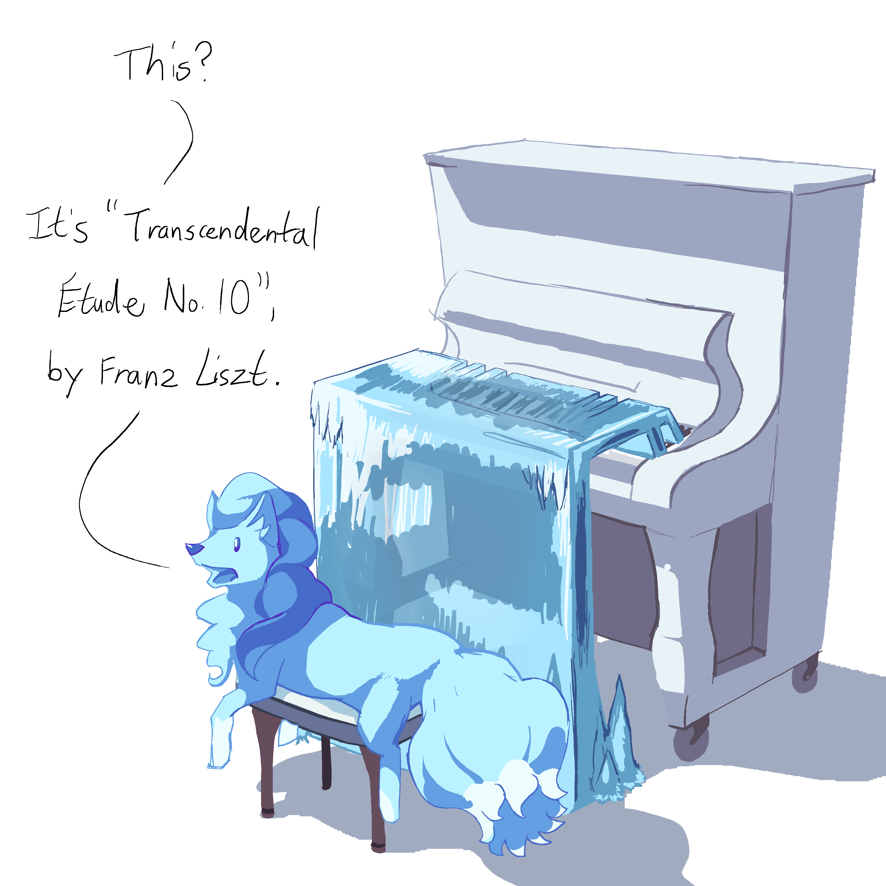

---
tags:
  - ice
  - music
  - piano
  - vicerre
---

# Rendition 004 – Piano (2021-07-11)

## Overview

I love the use of musical motifs as a means of storytelling. By associating a piece with a particular meaning, you can show the evolution of a meaning through the evolution of that piece. In particular, leitmotifs are pieces that represent a character, so they are excellent tools for expanding on that character.

I've always had an idea for how Vicerre's leitmotif could go, but I've never had the right combination of free time, experience, and money to compose it for real. In any case, Vicerre's leitmotif would be convoluted, so it would require a large investment just to reach that level. Until I can get to that point, I'll settle for a description of what it would sound like, and I'll share pieces that have similar elements to what I would create.

If I had to choose one instrument to represent Vicerre, it would be the piano. Pianos are commonly used to indicate elegance and class, which Vicerre would associate himself with. In addition, as a polyphonic instrument, pianos can create convoluted chords and patterns, fitting what goes through Vicerre's mind.

As for the piece itself, I've always thought it should have messy and dissonant qualities:

- It would be in an irregular time signature like 5/4 or 7/4.
- It would use second and ninth intervals.
- It would be in a minor scale.
- It would use tumultuous key progressions.

Inspirations include:

- Animusic's [Starship Groove (Disklavier)](https://www.youtube.com/watch?v=tT1irtlVxmA)
- Bach's [Prelude in D Minor, BWV 935](https://www.youtube.com/watch?v=Ijfvl05U-kE)
- Pokémon Diamond & Pearl OST: [Champion Cynthia's Theme](https://www.youtube.com/watch?v=K3l2H2uIb94)

In addition, while I wasn't aware of it at the time, I've found that Franz Liszt's repertoire lends well to the qualities I'm looking for. Thus, when determining what piece to mention in this drawing, I picked one of Liszt's pieces known for being intricate and tumultuous.

## Design notes

Vicerre is the type to let his abilities do the work for him if possible, which, in this case, means using his ability to grow ice to play the piano. When I composed this scene, details became more apparent when I thought about what should be presented and what Vicerre would do:

- In order to best see the ice in front of the piano, and in order to draw the connection between the person sitting in front of the piano and the ice, I drew him as an Alolan Ninetales.
- If Vicerre doesn't need to play the piano himself, he doesn't need to actually sit before the piano properly. I went for a relaxed pose to show that he doesn't need to put in physical effort.
  -Post-character development Vicerre cares about taking care of his surroundings, so he wants to keep the piano in good condition. He only uses as much ice as needed to play it, as excessive ice can strain the wooden parts.
- I needed to show that it was _ice_ that was playing the piano, since without clear indicators, it could be interpreted as water or glass. In order to show that, I drew extra icicles growing out of the ground, even if it would be unnecessary in-universe.

## Miscellaneous notes

- When writing up this post, I ended up searching for some phrases I thought were funny when put next to each other:
  - "how sharp can ice get"
  - "common deciduous trees"
  - "musical modes happiness"
- This was my first time drawing a piano! I used a lot of references here to make it look like a piano.

## WIPs

- [1](https://cdn.discordapp.com/attachments/331457840231219201/861460387609051176/Temporary_File.png)
