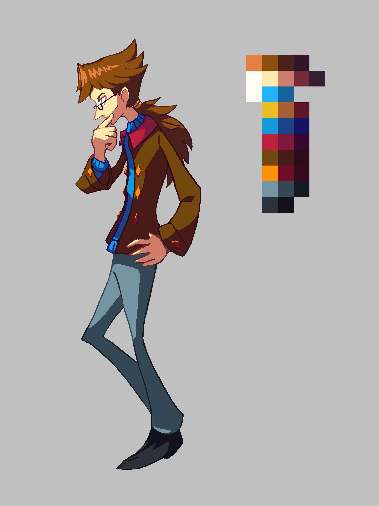

---
tags:
  - character design
  - vicerre alt
---

# Rendition 006 – Future Vicerre (2021-09-04)

## Story notes

In several years time, Vicerre has settled down as a senior researcher of oneirology in New Quendon—although he would consider that a side job in comparison to his personal pursuits. In addition, since he's more comfortable around people, he's made the effort to look his part. In addition, while he doesn't actually need glasses, he wears them for the aesthetic.

## Overview

Vicerre has evolved as a character since his original design was conceived. I updated his costume design and overall characterization [here](2021-06-30_illustration-001_character-reference.md), but I didn't make any changes to his physical appearance. Following that drawing, I got the idea to draw him with a different hairstyle, which I rendered here.

## Design notes

Since Vicerre has mellowed out, I think he would grow his hair out and have it become messy. Initially, I tried drawing him with longer, anime-style bangs, as inspired by Ryuusei Cartwright from _AdventureQuest_. However, the first sketch of that idea went too much in the other direction and made him look unkempt, so the idea petered out.

My inspiration was rekindled, however, from watching one of [Darquezze306](https://twitter.com/Darquezze306)'s streams. I discovered the character Diluc from _Genshin Impact_. In particular, his hairstyle interested me. It consisted of moppy short hair with a long ponytail. [As TV Tropes can attest to](https://tvtropes.org/pmwiki/pmwiki.php/Main/ShortHairWithTail), short hair + long tail keeps all the practicality of a short hairstyle with the order and grace of a long hairstyle. I thought that this was a natural next step in the evolution of Vicerre's design, so I drew his hair based on that trope. In addition, since it would take time for him to grow his hair out, I designed him as he might appear after a time skip. One of my college professors sported a glasses + ponytail combination, which inspired me to add glasses to the design.

## WIPs

- [1](https://cdn.discordapp.com/attachments/331457840231219201/880644885240246352/Temporary_File.png)
