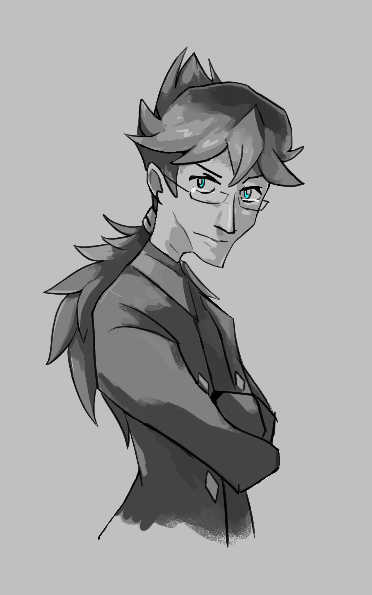

---
tags:
  - vicerre
  - vicerre alt
---

# Rendition 007 – Kyle Webster's Brushes (2021-09-10)

## Overview

I've always considered art a hobby, but it was only recently I felt like my abilities weren't where I wanted them to be. For this reason, I've started browsing online resources for ways to improve my art.

While I was searching for resources, I remembered that one of my favorite artists, [Sam Nielson](http://www.samnielson.com/), had often advertised an art course he offered. I don't think I am at the skill level required for this course, but I figured that I could take something away from the other resources he offered.

In particular, [one post on his official blog](http://www.samnielson.com/artsammich/2015/05/what-kind-of-brushes-did-you-use-for.html) reminded me that I had never integrated custom brushes into my workflow. In general, I never used custom brushes, since I was usually focused on practicing something else. Since I had hit a wall with the tools available at my disposal, however, this seemed like a good means of expanding my skillset. I wanted to start with his recommendation of Kyle Webster's brush megapack, but unfortunately, I did not have the resources to install the megapack itself. Instead, I settled for the brushes that were available on [Kyle Webster's Gumroad account](https://kyletwebster.gumroad.com/).

I tested the Doozy Inker and Builder brushes, two basic options that gave my lines a bit more texture than the default Photoshop brushes. For my subject, I drew future Vicerre. At the time, I was following [Darquezze306](https://twitter.com/Darquezze306)'s _Danganronpa_ stream, so the character Byakuya Togami also inspired the sketch.

I've always heard that brushes alone won't make your art amazing by themselves. While true, it doesn't mean that custom brushes are wholly ineffective. In this case, they've made my sketches look much more organic, which I see as a significant improvement in the quality of my art.

## WIPs

- [1](https://cdn.discordapp.com/attachments/331457840231219201/886115582297124874/unknown.png)
