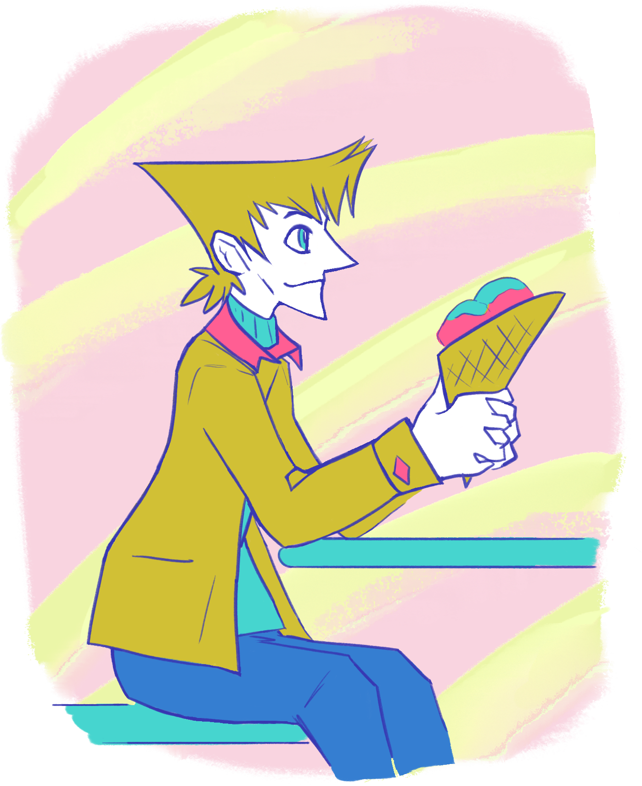

---
tags:
  - ice cream
  - vicerre
---

# Rendition 008 – Ice Cream (2021-10-20)

## Overview

I was inspired to experiment with art in different styles after seeing the wide range of fan content produced by _Deltarune_'s talented fan community. In this case, I sketched an image using some experimental colors.

## Design notes

Usually when starting with lineart, I use pure black as my line color and colorize the outlines later, but I tried a blue outline this time. The blue lines reminded me of the color from a blue ballpoint pen, so, for this piece, I used colors inspired by writing utensils as a theme. In general, the fill colors were inspired by markers, and the dirty yellow in particular was inspired by the dirty yellow of highlighters. I made the background pastel pink and yellow to match the aesthetic of many ice cream parlors.

For the content of the piece, I drew Vicerre with an ice cream cone. Ice cream is one of Vicerre's preferred treats, and it serves as an excellent metaphor for him. It is food that is icy, sweet, whimsical, and unhealthy, much like Vicerre himself. In addition, ice cream has been used as a status symbol in the past, which fits Vicerre when he plays an antagonistic role. Nowadays, though, he's much more casual about his preferences—a strawberry waffle cone from the local ice cream parlor suits his tastes just fine.
