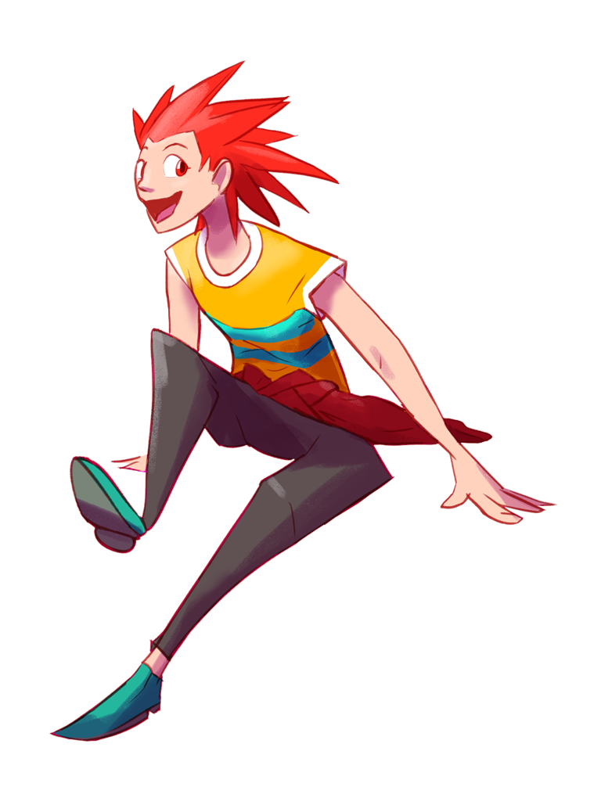

---
tags:
  - character design
  - solana
  - solana ref
---

# Illustration 002 – Solana (2021-11-11 – 2021-11-12)

## Overview

Solana is a character that acts as a foil to Vicerre in stories. In contrast to Vicerre's composed and droll nature, Solana is energetic and impulsive. Her personality lets me draw a wider range of stories. While Solana is a character I've wanted to use, her design hasn't been updated since 2013. If I wanted to draw her, I felt as though I should update her design first. Hence, I drew this image.

## Design notes

- As her name implies, Solana is sun-themed. As a result, her design makes use of many warm shades.
- Her personality also works well with a casual, summer-y outfit, so I have drawn her in one here.
- I felt like pure warm tones lacked contrast, so I added teal into the design. I chose teal as a cool hue since teal is often used as a fun, summer-y color.
- The spiky, red anime hair, while perhaps misplaced, is a design element that has been integral to the character since its inception, so I have retained it on this iteration.
