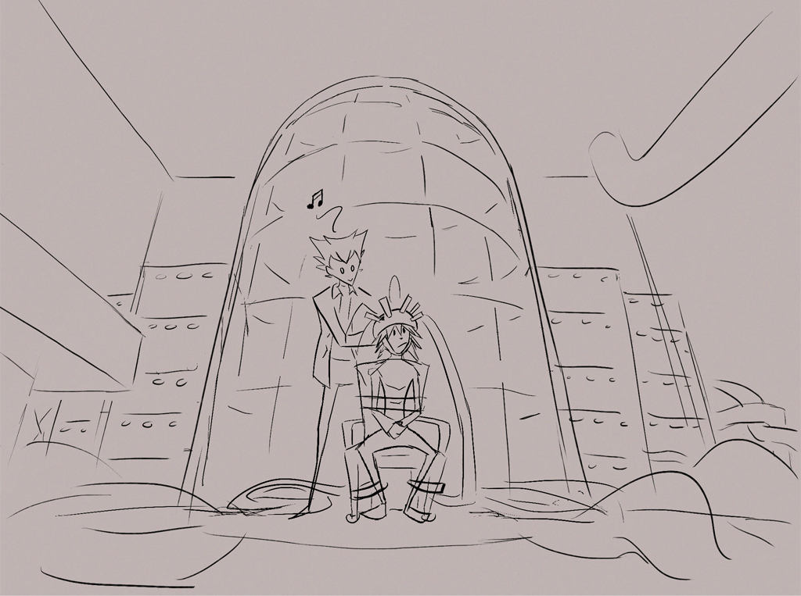

---
tags:
  - dream machine
  - solana
  - vicerre
---

# Illustration 003 – Dream Machine 0.1.3 (2021-11-24)

(Viewing at full size is recommended.)

> "Vic.... Is all of this really necessary to get the dream working?" Solana asks. She blows a tuft of hair out of her vision and scans the headset on her.
>
> Vicerre brushes Solana's hair away from her face, before giving the headset's strap a good yank. "Yes. If anything, we should take _more_ precautions."
>
> "'More precautions'?" Solana turns to see Vicerre. "What kind of things are we taking precautions for? ...And why do I need to be strapped in?"
>
> "Well... in case anything goes wrong, I can't have you suddenly disconnect from the system. The main purpose of the project isn't to find how to break people's minds, after all."
>
> "That just makes it sound like it _can_!"
>
> "Quite possibly, but I've fixed all the issues I've found so far. Besides, I take backups."
>
> Solana mulls over the implications of taking what, she presumes, are mental backups. "...You know, Vic, if I didn't know you, I'd seriously be having second thoughts."
>
> "...I'll take that as a compliment."

## Story notes

Vicerre is the type to devise his own technology to further his projects. One of his earlier projects was a machine that could interface directly with someone's brain—and with the help of a viral agent, rewrite it. Since creating the device, he has repurposed that technology for more... benign purposes.

Other sketch details not mentioned in the short story:

- Headset acts as the neural interface
- Faraday cage is used to reduce noise from external electromagnetic signals (and it looks dramatic)
- Supercomputers are used for general processing

## Overview

A weak point in my drawing ability includes drawing settings. This is an issue when my vehicle for practicing art is one driven by stories. In the past, I've practiced drawing backgrounds, but these exercises were never at a point where I felt comfortable sharing them.

To my surprise, this sketch—which started out as a sketch of Vicerre showing off his dream machine—ended up with a detailed background. In past background exercises, I drew the background first and then populated it with props and characters. In this case, I started by drawing my characters, followed by props and the background. It seems that this order of fleshing out a sketch leads to better results.

## Miscellaneous notes

This piece is also a homage to the following pieces made by [nebezial-asheri](https://www.tumblr.com/stjepan-sejic) and [sigeel](https://www.tumblr.com/sigeel), a pair of creators that inspire my art:

- [nebezial – his asisstants hips were nice](https://www.deviantart.com/nebezial/art/his-asisstants-hips-were-nice-308705196)
- [sigeel – 1 year anniversery](https://www.deviantart.com/sigeel/art/1-year-anniversery-378434415)
