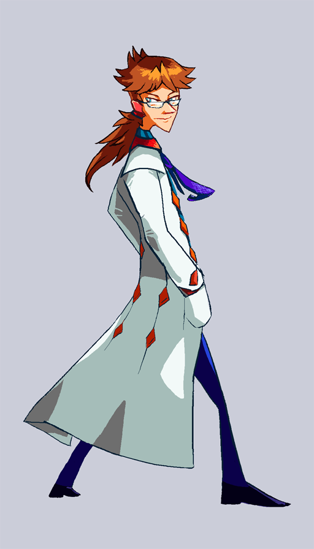

---
tags:
  - costume design
  - vicerre
  - vicerre alt
---

# Rendition 010 – Anime-Inspired Design (2021-11-26)

## Overview

Given Vicerre's origins in science fiction, I try to keep Vicerre's design within the confines of practicality. However, that doesn't mean it's not fun to imagine alternate designs for him.

## Design notes

My motivation this time was to give him more anime-inspired design elements. This amounted to a more fantastical-looking labcoat and tie. I also drew him in his future appearance, given how it has even hair that's even more anime than in his regular design.
