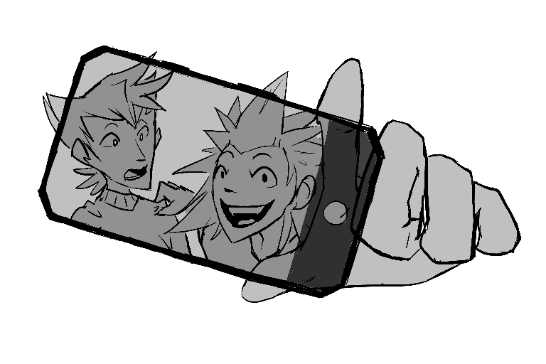

---
tags:
  - selfie
  - solana
  - vicerre
---

# Illustration 004 – Selfie (2021-11-26)

## Overview

This sketch is an exercise in drawing character interaction. I figured the best way to present my characters interacting with each other was to draw Solana's idea of a self-portrait. Along the way, I ended up practicing character expressions and exaggerated proportions.

## Design notes

Expressions are an aspect of art I've usually only practiced in a vacuum, so integrating expressions into the context of a greater piece is a skill I wanted to practice. For this reason, and considering how he isn't very expressive normally, I went out of my way to have Vicerre look in mild surprise.
