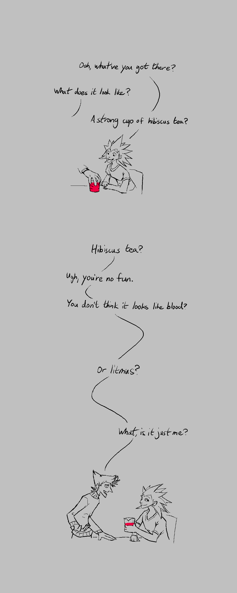
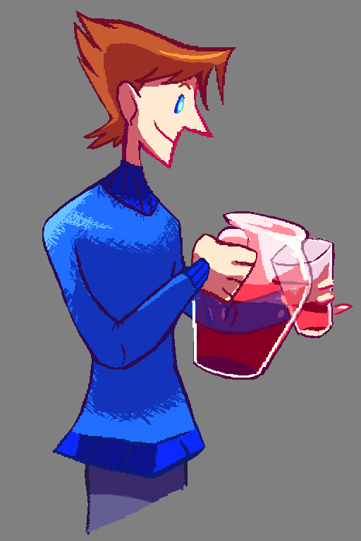

---
tags:
  - comic
  - hibiscus
  - solana
  - vicerre
---

# Illustration 005 – Nerds (2021-11-28)

## Story notes

After the events of _Spaghetti Ice_, Vicerre has become comfortable opening up to Solana. Sometimes, the things he shares with her includes what he finds interesting in the latest scientific journals. Sometimes, the things he shares with her are dumb, nerdy jokes. Either way, Solana enjoys listening to Vicerre.

## Overview

I've pushed my abilities a little more with this sketch. In [the previous sketch](2021-11-27_illustration-004_selfie.md), I drew a single still. In this sketch, I drew two panels and strings of dialogue.

## Design notes

The design of the dialogue bubbles is inspired from [@sigeel](https://sigeel.tumblr.com/)'s webcomic, _Blood Stain_. The dialogue bubbles are quite minimalistic, so they are simple to incorporate while still retaining some personality.

## Bonus sketch

