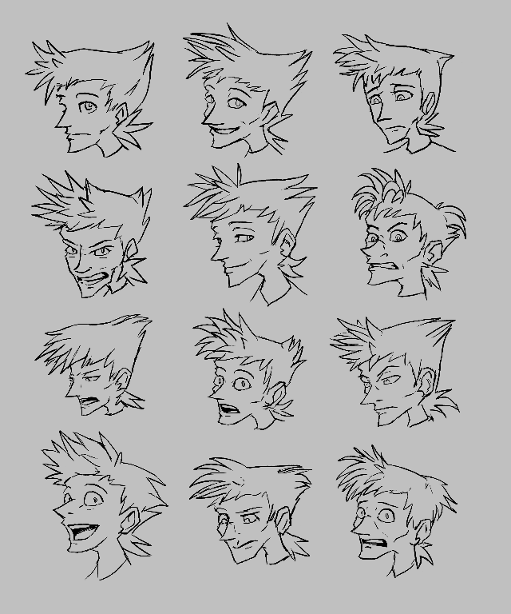

---
tags:
  - sketch
  - vicerre
---

# Rendition 011 – Expressions (2021-12-08 – 2021-12-11)

## Overview

I usually find it boring to draw the same thing twice, so I perturb at my style from one sketch to the next. However, this makes my art style ill-defined, and I can't draw a sequence of images if any two sketches are too inconsistent. In order to nail down a consistent art style as of today, I drew a set of expressions for Vicerre. For this collection I used "Kyle's Inkbox – Mr. Natural Brush Smooth".

## Design notes

- When drawing characters, I usually start by drawing the character's eyes and work outwards from there. However, this workflow can be limiting for certain expressions. There are expressions that only "click" when you draw in the surrounding facial features correctly. I found [an interesting video from Aaron Blaise](https://www.youtube.com/watch?v=TQc4MU-gsiQ) that demonstrates how people can identify expressions from features in the nose and mouth, before the eyes are even drawn. I thought that this made for an interesting exercise. Trying to draw expressions starting from the face shape and nose helped me identify how those features contribute to the expression and prevent those expressions from being cut-and-paste.
- If you're working with an animal character, you can often use the animal's ear or fur in amplifying the expression on that character's face. Likewise, on human characters, you can use hair. I made a point in these drawings to make Vicerre's hair frizzy when angry or surprised or droopy when sad or terrified.
- Vicerre's has an emotional range. There were expressions I wanted to draw (like unbridled glee or smugness) that I just couldn't place on his face. If I wanted to draw these expressions, they would need to be drawn on another character.
- The inspirations for my art style are quite predominant. Tetsuya Nomura's art was my first introduction to human art, and you can still see features from his art style in mine through the use of sharp angles (especially on the ear) and precise lines. I also see some inspiration from classical Disney movies, such as how I draw eyes as spherical wedges.
- In general, drawing expressions is fun and useful for reference purposes, but expressions themselves aren't generally the skill I need practice with. For me, it's easy to make an expression work in a vacuum, but it's much harder to draw the right expression for the given scene. Besides, I use a simpler art style for more complex scenes.
