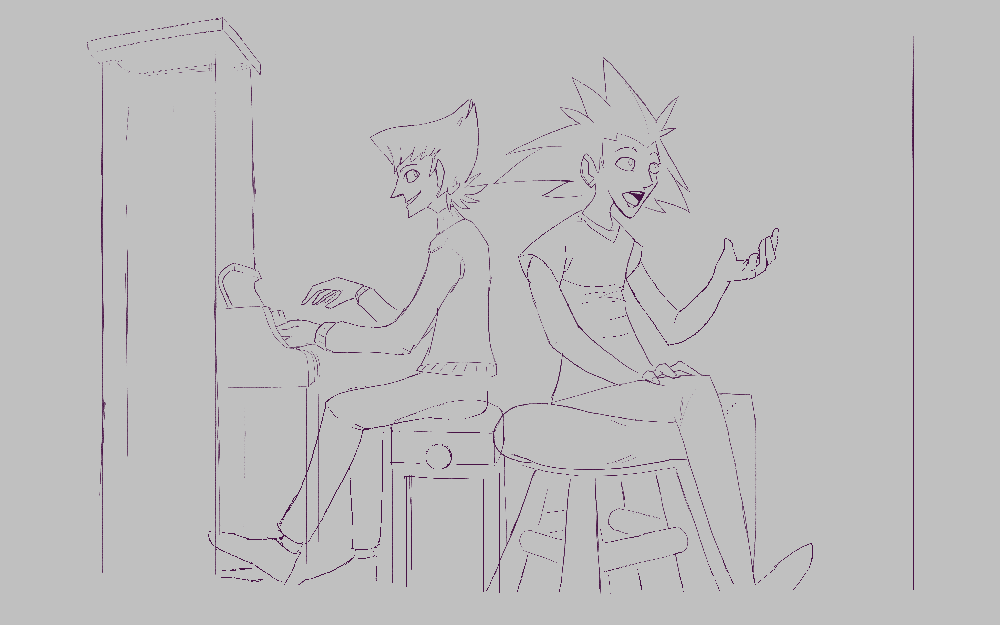

---
tags:
  - sketch
  - piano
  - solana
  - vicerre
---

# Rendition 012 – River Song (2021-12-21)

## Overview

Cynthia Gray's "River Song" is a track from my childhood/teenage years that has stuck with me. I lack the vocabulary to articulate the technical reason why, but there's something about the song's progression that touches me. It doesn't hurt, either, that it was part of our semester performance, so I was well-acquainted with the song.

The song makes rounds in the analog world, but there is little about it online. Because of this, I transcribed the song from sheet music into a MIDI format, such that I can create my own arrangements of the track in the future.

That being said, this post is not about the song. Instead, this post is about the image the song inspired. In particular, it inspired me to draw my characters making music. Vicerre would be the pianist, and Solana would be the singer. Given my prior experience in drawing them interacting and with props, I felt comfortable composing a scene with them. Having been inspired by [Toniko Pantoja](https://www.youtube.com/c/TonikoPantoja) recently, I focused on a composition with more perspective this time, instead of a flatter, cartoonier style. Admittedly, the image is just a sketch, but it fulfills the original intent of the image, which is to show more of my characters.

## References used

I referenced the following 3D piano models on SketchFab in drawing the image:

- [1](https://sketchfab.com/3d-models/upright-saloon-piano-bf96bc804b3b481baba9c15a312a5277)
- [2](https://sketchfab.com/3d-models/old-piano-fc9cc06615084298b4c0c0a02244f356)
