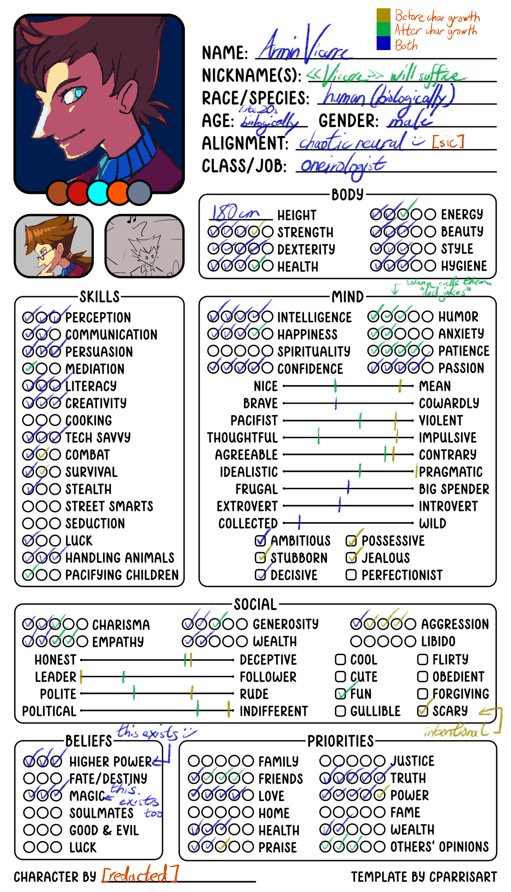

---
tags:
  - meme
  - vicerre
---

# Rendition 013 – Vicerre Character Sheet (2021-12-30)

## Overview

[This character meme by cparrisart on Twitter](https://twitter.com/cparrisart/status/1475535559984656392) has been making rounds in my social circle. I found it interesting, as it covers a wide range of topics that helps with building a character. Thus, I filled out this template. In addition to the prompt as given, I took inspiration from [this character meme by GurepyonArt](https://twitter.com/gurepyonart/status/1411451045310513159), where the template is filled out in-character.

## Design notes – Handwriting

Designing a handwriting style for Vicerre was an unexpected pleasure in filling out this template:

- Vicerre uses a pen for everyday use. He chooses a pen, specifically, since it is practical and permanent, much like the mark he wants to leave on the world.
- Yellow and blue are the choice of colors used, roughly reflecting a prominent color in his design before and after character development.
- He writes his letters tall and thin, with little space between each of them, matching his tall, thin figure.
- The sharp points on letters are emphasized, such as the peak and valley of "A" and "V", matching his angular features. To boot, the valley of the "V" in "Vicerre" violently pierces the baseline.
- The text he writes is angled forward, reflecting how he wants to move forward, but his hands can't keep up.
- Additional details emphasizing angles in his design include:
  - The angled connectors used in arrows
  - The use of checkmarks instead of dots or x's to fill in each circle
  - The shape of smiley faces resembling checkmarks
  - The use of lines instead of circles on the sliding-scale fields
- The bottoms of his f's and t's are curved, in order to distinguish them from +'s in math. (This happens to be a quirk I picked up from my own experiences in college.)

## Design notes – Miscellaneous

- Given how he has gone through a character arc, Vicerre has different values for fields depending on where he is on that arc. I took inspiration from [Sunfished](https://twitter.com/sunfished/) in color-coding those differences. Colors and what they represent can be found on the legend at the top right of the completed template.
- Vicerre comes from the European fantasy equivalent of his universe, so values on the form reflect this origin. He uses metric units instead of imperial ones, and he uses guillemets for definitions. Coincidentally, guillemets are angular, like other parts of his writing style.
- "Chaotic neural" as an alignment was a typo I liked too much to leave out. Both with and without typo, the value fits Vicerre, and Vicerre would enjoy this clever wordplay.
- Given how _Pokémon_ is one of the inspirations for Vicerre's setting, it comes naturally that the "handling animals" field would be filled in. Otherwise, animals don't come naturally to his line of work.
- Before he underwent character development, one of Vicerre's defining traits was his ruthless pragmatism. On the template, it exceeds the range as provided.
