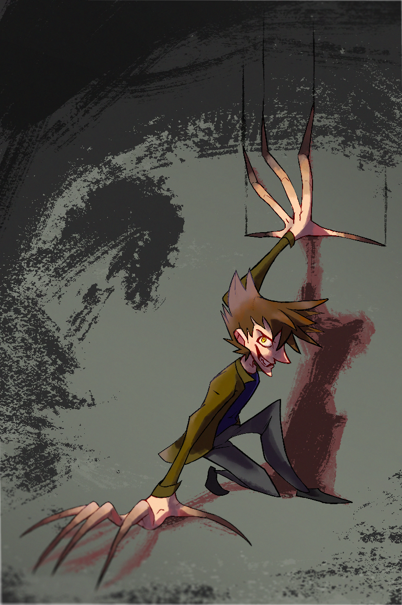

---
tags:
  - vicerre
  - vicerre alt
---

# Rendition 014 – Claws (2021-12-28 – 2021-12-30)

## Overview

One of the abilities Vicerre kept from his time as an antagonist is the ability to turn his hands into spindly, razor-sharp claws. While awfully scary, Vicerre doesn't have much use for the ability now. Solana finds the ability cool, however, and it makes for a great Halloween photoshoot.

## Story notes

- Vicerre is reluctant to act as his past self, but if prompted, he will revel in the opportunity.
- Vicerre doesn't actually have his past self's gold irises. In-universe, Solana edited the color in while post-processing.

## Design notes

For a long time, I've struggled to draw Vicerre's claws convincingly. I've tried drawing him with his claws protracted many times before, but I could never make the image look scary enough. Granted, this image isn't as scary as other art I've seen, but I find this attempt convincing, at least.

One technique I've seen in making art scary is to take a familiar subject and exaggerate it to grotesque levels. One reason I was convinced by this drawing more than my previous attempts was because the drawing ended up following similar principles. Vicerre looks more gaunt and scalene than normal, and he is drawn with a crooked smile, noticeable fangs, and harsher outlines on the sideburns.

Another technique used to make images scary to is to add grit to the image. In this case, I found the technique to be effective. I used rough brushes in making the drop shadow and background gritty:

- Kyle's Inkbox – Deliciously Dry Brush
- Kyle's Inkbox – Go Gritty 2
- Kyle's Inkbox – Grinder

In addition, I wanted to make the lineart gritty, but I couldn't find a way to do so without redrawing it from scratch. I wasn't that invested into this piece, so I left the lineart as it was.

## Miscellaneous notes

- The eye and hind arm are anatomically inaccurate for the camera angle and pose, but I think they work in the context of the drawing.
- I previously found that increasing the saturation of a color on the boundary of light and shadow gives skin a more vibrant appearance. This time, I tried using this effect on other parts of the drawing. It made Vicerre's hair look more vibrant, so I kept the effect there. It did not work as well on his clothes, however, so I removed the effect there.
