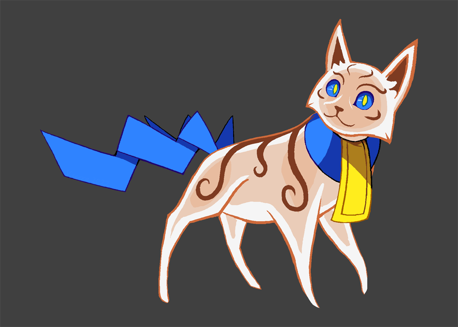

---
tags:
  - character design
  - concept art
  - creature design
  - nekorei
---

# Illustration 006 – Nekorei (2022-01-17 – 2022-01-18)

## Overview

One of the characters that played a large role in the role play was a Kitsunoh, a fan-made Pokémon design from Smogon's Create-a-Pokémon project. I wanted to adapt the character into an original design. However, many key attributes of the design could not change without the storyline falling apart, which made redesigning her a challenge. In general, the following attributes could not change:

- Her body is mainly ghostly.
- Her body has parts that are physical.
- The physical parts of her body can slip into small openings.
- She is small enough to ride on a person's shoulder.
- She is bound by gravity.
- She is agile.

This image depicts the second version of this design.

## Design notes

In contrast to [my first attempt](https://vicerre.tumblr.com/post/672868421809127424/), I deviated from the concept more, which gave me more room for inspiration on other parts of the design:

- I focused on the _shide_ whiskers in the last design, turning them into a pair of _shide_ tails. I specifically designed her with two tails instead of one to keep the design symmetrical, discourages resemblances to a certain lightning bolt mouse, and, coincidentally, alludes to the _nekomata_ yōkai.
- I continued the "sacred" theme of the last design by using the coat pattern of the "sacred" Birman as a color inspiration.
- I designed her collar after an _ofuda_, another type of Shinto talisman.
- I reworked the body markings from the previous design into artistic, tiger-like stripes.

The last step of the redesign was to give the character a new name. This design no longer had _kitsune_ nor Noh elements, so it made no sense to retain any part of the original name. The user [LucarioOfLegends](https://www.smogon.com/forums/members/339349/) mentioned Nohneko, and I thought that it made sense to incorporate _neko_ instead of _kitsune_ in a name. Eventually, I settled on "Nekorei" (猫霊). According to DeepL, this means "cat spirit" in Japanese, which is literal enough while sounding nice when transliterated. Coincidentally, the name shares a similar syllabic stress pattern as "Kitsunoh", which makes it easy to mentally substitute.

## Miscellaneous notes

Instead of a species name, I considered giving the character "Lucie" as personal name, alluding to "lux" and "lucky". However, I felt that this name was too feminine and elegant for the character's personality, so I did not proceed with a name in that direction.

## WIPs

- [1](https://64.media.tumblr.com/a7a174656d7106e1f01b566e28af563c/ced7010b213c1ef2-8e/s500x750/7f82d2c83c4b578bb10ed371eb707e2e57c593b6.png)
- [2](https://cdn.discordapp.com/attachments/727558323741655041/932849942916128768/unknown.png)
