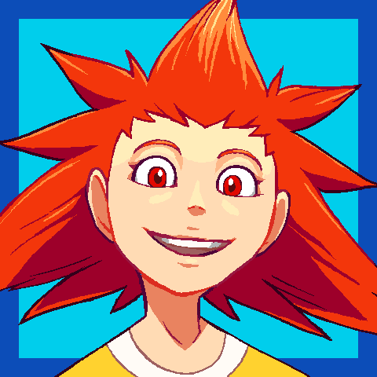

---
tags:
  - portrait
  - solana
---

# Rendition 015 – Solana Portrait (2022-02-05)

## Overview

I've been working on a project that uses Solana as a character, so I thought it would be a good time to draw more art of her—in this case, a portrait.

As Solana acts as a contrast to Vicerre, her portrait is drawn as a contrast to [Vicerre's](../2021/2021-07-01_rendition-003_profile-icon.md):

- Vicerre's sidelong glance literally indicates that he isn't straightforward with others. Meanwhile, Solana's portrait is as direct as can be.
- Vicerre's portrait is lit with unnatural lighting and is displayed on a dark background, suggesting a sinister aspect to him. In contrast, Solana's portrait uses natural lighting on a bright blue background, suggesting a more classically heroic nature.

## Design notes

In earlier versions of the image, I thought that Solana's expression came across as creepy, which did not fit the character at all. I wanted to make the portrait look friendlier, but I had trouble pinning down which aspects of the drawing to change. I was able to nudge the expression in the right direction by making the irises larger, but the creepiness still remained.

Luckily, [Amamama](https://www.smogon.com/forums/members/478830/) on Smogon forums was helpful in providing specific, actionable feedback, which helped me understand why Solana's expression looked wrong. In addition, this feedback helped my growth as an artist in general.

- Solana's eyes were too wide. In a genuine smile, the eyes squint.
- Solana's bottom teeth were showing, making the smile look clenched. In a genuine smile, it's rare to see a person's bottom row of teeth.

## WIPs

- [1](https://cdn.discordapp.com/attachments/331457840231219201/939382148996145182/unknown.png)
- [2](https://cdn.discordapp.com/attachments/331457840231219201/939632851320709200/unknown.png)
- [3](https://cdn.discordapp.com/attachments/331457840231219201/939636163583574106/unknown.png)
- [4](https://cdn.discordapp.com/attachments/331457840231219201/939640826101911602/unknown.png)
