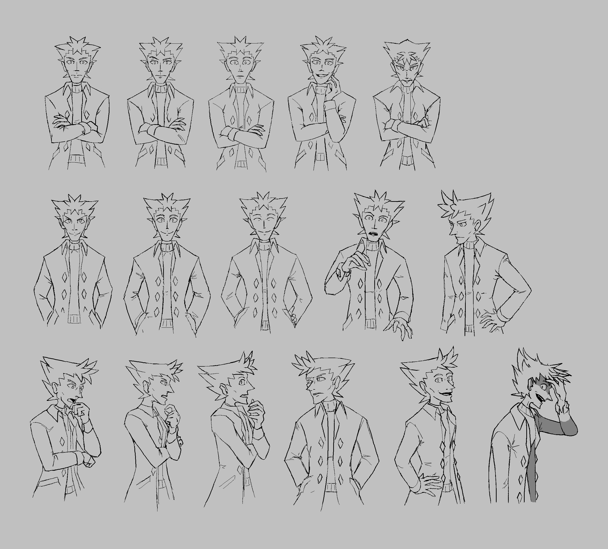

---
tags:
  - portrait
  - sketch
  - vicerre
---

# Rendition 016 – Half-Body Portraits (2022-05-19 – 2022-06-03)

## Overview

These line drawings depict Vicerre in a variety of expressions, as drawn from the waist-up.

This image could be considered a follow-up to [my previous series of line drawings](../2021/2021-12-11_rendition-011_expressions.md), which depicts Vicerre in a variety of expressions, as headshots.

## Observations

- The motivation for this image came from deadrat, who suggested drawing visual novel-style portraits of Vicerre. As inspiration, I referenced portraits from the _Danganronpa_ series of games. As a consequence, the design in the portraits here is simpler and cleaner than what I consider Vicerre's usual character design.
- When rendered with proper geometry, Vicerre's head does not convey a trapezoidal silhouette when observed from straight-on, whereas it does so from any other angle. In order to preserve this design trait, I've elected to use a [Cheated Angle](https://tvtropes.org/pmwiki/pmwiki.php/Main/CheatedAngle) on portraits drawn from straight-on to portray this effect.
- Creating a sequence of images produces contrast, which can be used to tell a story in a way a single illustration cannot. Contrast seems essential in order to depict certain concepts in art, such as with the age of a character or when a design is meant to be scary. Otherwise, the point of comparison seemingly defaults to realism.
- Following the above, I was delighted to find that I could tell a narrative through his body language. Initially, he comes across as someone who is guarded, as depicted by looking at the camera straight-on and having his arms being folded across his front. Once he warms up to someone, however, he holds his arms to the side and leans slightly. (...In retrospect, I seem to have designed the narrative of a tsundere.)
- I would like to say that I've included [left-hand/right-hand imagery](https://tvtropes.org/pmwiki/pmwiki.php/Main/ASinisterClue) in how Vicerre gesticulates, but I can't. However, I do find the idea of Vicerre being left-handed an interesting one.
- Vicerre's emotional range made for an interesting challenge in drawing specific portraits. For instance, the portrait where he smiles directly at the camera took the most iterations to draw, since it was easy to make the expression too intense for his character. Additionally, I scrapped many sketches depicting him with certain expressions I thought looked too intense on him (e.g. rage or madness), and more yet simply because his character wouldn't allow for it (e.g. anguish or fear).
