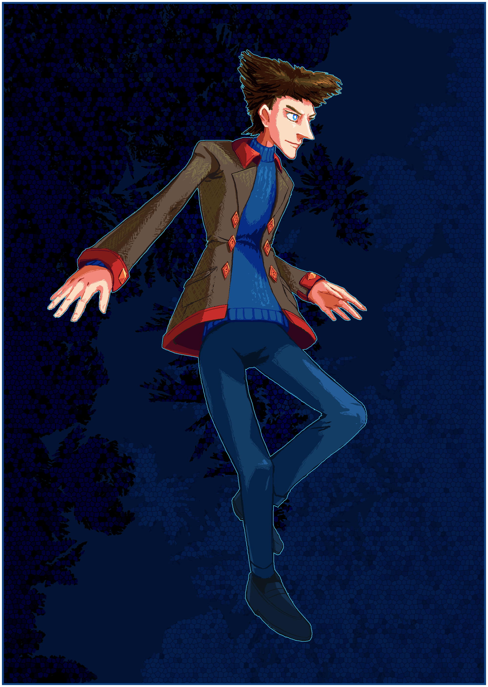

---
tags:
  - character art
  - vicerre
---

# Rendition 017 – Vicerre Reference (2022-06-08 – 2022-06-09)

## Overview

[ausma](https://mobile.twitter.com/ausmacon) is a friendly and talented artist who has an enthusiasm for character designs. This sort of enthusiasm motivated me to draw an updated, more detailed reference for Vicerre, which I have presented here.

(For reference, the last reference image of Vicerre, from June 2021, can be seen [here](../2021/2021-06-30_illustration-001_character-reference.md).)

## Design notes

In redrawing Vicerre, I made the following edits to his character design:

- In order to add more color variety to the design, I extended the red accents on the collar of his jacket to the jacket's other extremities.
- The jacket was given a herringbone texture, in order to convince the viewer that it is tweed, rather than what may be construed as leather.
- In order to give the design more depth, the rhombus-shaped cufflinks on the jacket were extruded into pyramids.
- For clarity, the footwear is drawn as black socks and loafers.

Lastly, I would like to bring attention to the background. As Vicerre is associated with ice, I wanted to incorporate ice themes in the image. I incorporated window frost patterns and polygonal shapes in the background to evoke this theme.

## Resources used

- [Magic Poser](https://webapp.magicposer.com/)
- "So the Narrator tried out this whole 'having an actual appearance' thing recently" ([1](https://www.reddit.com/comments/v80wc1/), [2](https://twitter.com/SpicyAvogato/status/1534620746202357761))
- [Window frost stock image](https://www.needpix.com/photo/1386051/)
