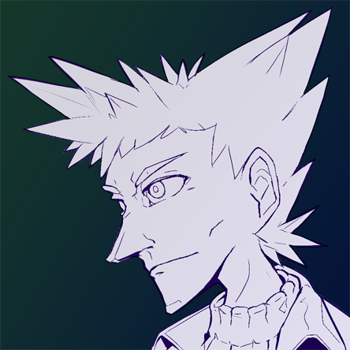

---
tags:
  - icon
  - vicerre
---

# Rendition 018 – Vicerre Icon (2022-07-03)

## Overview

One of the first drawings I made to break in the new Huion tablet was to draw my default art subject, Vicerre. I drew a headshot of him, with the goal to use the drawing as an icon.

## Design notes

- When drawing with the Huion, my strokes had much wider variety in thickness. This made my lines more expressive. I noticed that my lineart drew similarities to Tetsuya Nomura's art style, so I leaned into it. While drawing, I looked up references of his artwork as inspiration.
- I enjoyed being able to draw fine contours on certain areas, such as the curve of the nose and the fold in the collar.
- I have yet to figure out a method of coloring in this lineart in a way that doesn't make it look gaudy. As an alternative, I left the drawing as lineart and splashed several _Final Fantasy_-inspired gradients on it for flair.

## References used

- [1](https://twitter.com/ITumeta/status/1329072089345581060/photo/1)
