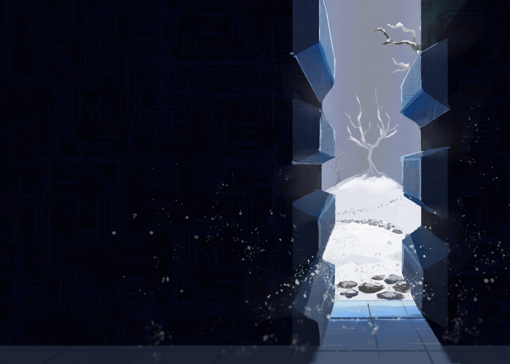

---
tags:
  - environment art
  - illustration
---

# Illustration 007 – Inner Space (2022-07-26 – 2022-07-29)

## Overview

This image is the next in my series of display tablet experiments. For this image, I drew subject I desired to practice: environment art.

As a subject for this exercise, I rendered a setting from _Shaved Ice_—a cyberpunk-esque, vault-like door, with a snow-covered park behind it. The significance of this setting is a spoiler, however, so I will not explain the image's context further.

## Design notes

- Given how I had prior familiarity in rendering an environment, I focused more on composition in this exercise:
  - The composition applies the [rule of thirds](https://en.m.wikipedia.org/wiki/Rule_of_thirds).
  - The piece uses dramatic contrast between light and dark regions to draw the viewer's eye.
  - The vanishing point and light source act as focal points that draw the viewer's eye to the background.
- I reapplied some lessons from previous exercises [1](../2021/2021-08-19_rendition-005_iceworks.md), [2](../2021/2021-11-16_rendition-009_painting.md) in rendering this piece:
  - To create the illusion of depth, I lowered the contrast on an element the further it is in the background.
  - To create the illusion of depth, I liberally applied tilt shift filters to foreground details.
  - To make the composition more cohesive, I applied textures and noise filters.
  - To make the colors pop, I applied a saturation filter to the elements of the image that were closer to the light source. I still don't understand why this technique works, but I will accept it as a cheat until I do.
- It was an inconvenient decision on my part to choose a setting which employed orthogonal lines. In contrast to the natural landscape in the background, it is impossible to make orthogonal lines look accurate without explicitly measuring them. Therefore, I spent most of the time on an impromptu classroom exercise in one-point perspective. While an unexpected consequence, I admit that this decision helped me significantly with rendering correct perspective and lighting.
  - As an aside, there is an accidental (if spoiler-prone) metaphor here between the organic, freeform design of the background and the technical, measured design of the foreground.
- Considering how perspective became the main skill exercised, I simplified other elements of the piece—such as the linework—to compensate. In particular, I restricted myself to using one brush (spatters aside) while painting (Kyle's Inkbox – The Blake).
- Originally, the composition would have included characters from _Shaved Ice_. However, as I took too long to render the environment, I removed peripheral details for the sake of time.

## Resources used

- [1](https://www.deviantart.com/michaelgibbons0/art/885306817)
- [2](https://www.fotolia.com/id/66995000)
- [3](https://www.pinterest.com/pin/428053139563116495/)
