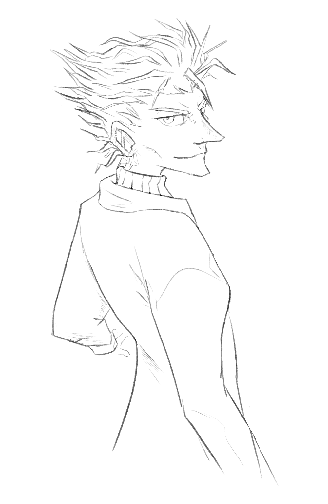
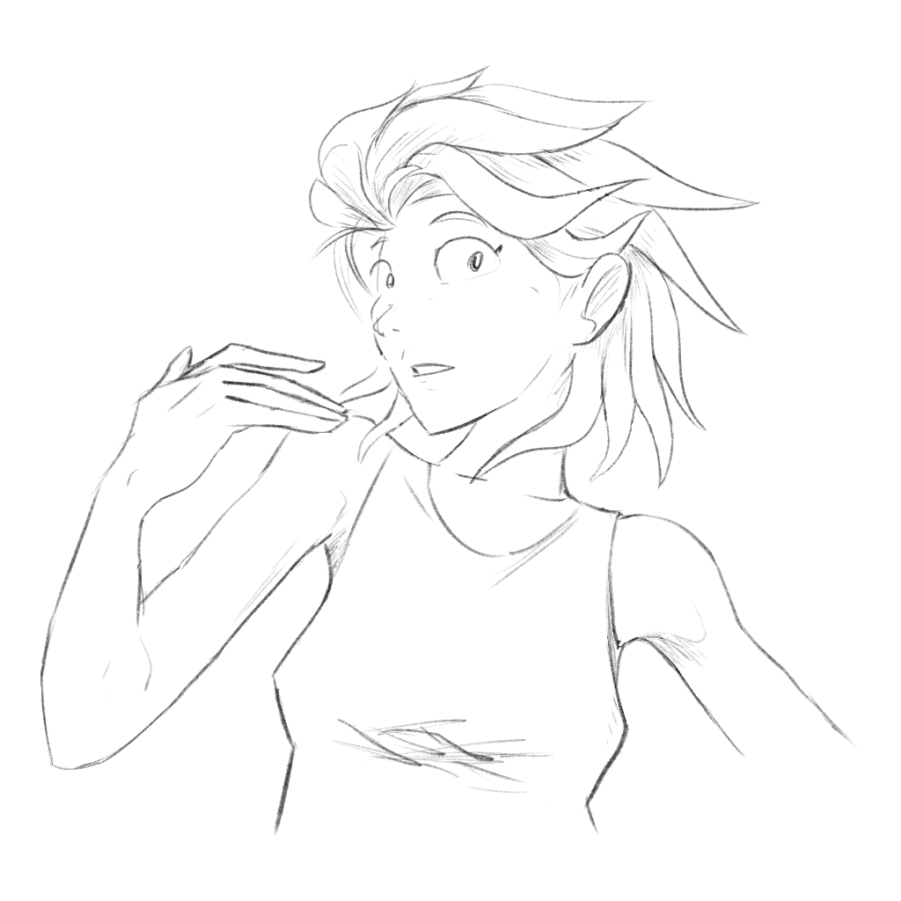

---
tags:
  - hair
  - sketch
  - solana
  - storyteller
  - vicerre
---

# Rendition 021 – Hair Design (2022-08-29 – 2022-08-30)

## Story notes

> Solana pulled one of her locks. Yesterday, her hair flexed whenever she pulled on it. Just now though, it had dangled, unresisted.
>
> Looking over at Vicerre, she noticed that his hair looked coarser than usual, as though someone had blasted him with a leaf blower. She glanced hesitantly between her hair and Vicerre, tilting her head.
>
> Vicerre looked up from his paper and at Solana. He tilted his head, scowled past the ceiling, and said, "...Changed the compressive strength constant, have you, Storyteller?"

## Overview

The designs for my characters originated in the early 2010s. Back then, my art style was heavily inspired by that of Tetsuya Nomura; it was animesque, polygonal, and employed convex lines. His art style laid the groundwork for the designs of my characters, which I would carry over as I continued development of my own art style.

Using his art style as inspiration, however, had an unintended effect on my character designs. After all, Tetsuya Nomura's characters are infamous for codifying the trope of shōnen characters having iconic, spiky hair, and that influence could be seen on my characters.

As I consumed character designs from other artists, the spiky nature of my characters' hair became increasingly prevalent. For many months, I wanted to temper my character designs' hairstyles, but every attempt at editing their designs lead to failure; like the Eiffel Tower, this trait started out as an eyesore, but it became too iconic to remove.

It was only when I prompted Dall·E 2 to generate variations on my characters was I compelled to revisit this design element. If an AI could notice how spiky their hairstyles were, that element must be that much more blatant when perceived by a human. Thus, I hashed out updated hair designs for the two.

## Design notes

- Vicerre: Originally, I sought to use inspiration from _Arcane_, _Blood Stain_, and _Genshin Impact_, using the characters Viktor, Vlad, and Diluc, respectively. I drew a hairstyle where the individual hair strands draped down instead of up. While novel, this iteration made his design look too mundane. His upward-rising hair always gave him a subversive appearance, so stripping that trait from him stripped him of his identity. I tried variations of upturned hair, but nothing matched my mental vision of him. Ultimately, while I could not alter his overall silhouette, I was able to temper the quality of his hair strands, adjusting them from being perfectly sharp to being unkempt and wavy.
- Solana: As Solana isn't as well-defined as Vicerre, I was able to take a liberal approach to updating her hair design. For her hairstyle, I took inspiration from the Pokémon Ninetales. You can see that her hair is parted into smooth tufts, each resembling a Ninetales tail. Additionally, I took inspiration from Solana's _Spaghetti Ice_ counterpart; as Clementine is more outdoorsy, I kept Solana's hair on the short side.

## Observations

- Brush used: Dry Media Brushes – Ultimate Round Hard
- While I was drawing these images, I found myself struggling to find certain images deep in my Like history. As a solution, I created a Pinterest account and used it to aggregate images for inspiration. In turn, having many high-quality images available as reference influenced my art style, to that of a style considered more conventionally appealing. While aesthetically satisfying, this development makes me feel uneasy about drawing Vicerre, as he is not meant to be conventionally appealing.
- When my default target when drawing humans is a character with numerous intricacies and details in his facial design, drawing cute round female faces becomes boring in contrast. On the other hand, drawing female bodies is something I haven't had much practice with, and thus made for a surprising additional exercise.

## References used

- [1](https://twitter.com/EsbenLash/status/1559937908009754626)
- [2](https://twitter.com/Nickwheee/status/1506746031077167104)
- Special thanks to [moscd](https://moscd.tumblr.com/) for providing feedback on my drawing of Solana.

## Bonus sketches

- [1](https://64.media.tumblr.com/4b7071b61176810629584a65bc17dfd7/f1fa1b8a46901f77-ec/s1280x1920/14409518dc285ce24da702cf7440ed520012f6d7.pnj)
- [2](https://cdn.discordapp.com/attachments/261586968230494219/1013646760725446686/unknown.png)
- [3](https://cdn.discordapp.com/attachments/261586968230494219/1013651993371344917/unknown.png)
