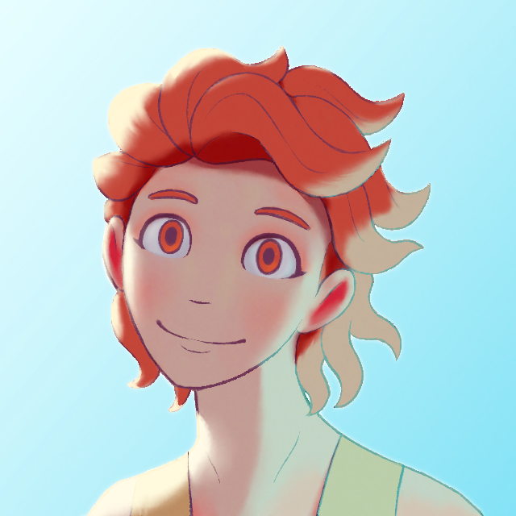

---
tags:
  - icon
  - lighting
  - portrait
  - solana
---

# Rendition 022 – Three-Point Lighting (2022-09-04 – 2022-09-05)

## Overview

Thanks to the magic of social media algorithms, I recently rediscovered the art of Sam Nielson, otherwise known as Artsammich. His art style is a favorite of mine, as he understands lighting on an unparalleled level.

When I discovered Sam's art back in the halcyon year of 2009, I thought his art style was delightful, if unattainable for a hobbyist like myself. Now, with thirteen additional years of life under my belt, I still think his art style is delightful, but it is now on the cusp of achievability.

Whereas many art lighting tutorials explain _what_ an artist can do to render lighting effectively, Sam Nielson's courses are the only ones I found that explain _why_. For example, I often hear lighting tips such as "create shadows by applying a dark purple hue on a Multiply layer" or "make lighting richer by increasing saturation at the terminator". These tips are beneficial for artists looking to create something of quality, but they limit the artist to one particular context. Instead, learning how lighting operates on a mathematical and physical level allows the artist to diversify.

In order to practice lighting using Sam Nielson's techniques, I studied how he organized his Photoshop layers in [this video](https://www.youtube.com/watch?v=vRlc2B5l-HE). In applying lighting to my study, I thought it would be more fun to use Solana as a subject instead of the default sphere. Solana has a round character design, so I can still apply lighting techniques to her while drawing a subject in which I hold a personal interest. As a bonus, this exercise doubles as a colored reference for her updated design.

<!-- portrait photography shot names -->

## Design notes

- Brush used: Kyle's Inkbox: Mr. Natural 2017 B
- Smudge brush used: Sam's Brushes: Smudge Nice
- Using lighting layers with blending mode set to "Screen" gave my render a Pixar-like quality. This makes sense, as Sam Nielson's lighting techniques are grounded in how 3D modeling software calculates lighting.
- I had to cheat the lighting on the eyes to make them less soulless. When studying Sam's art, as well as the art of Pixar, I noticed how the eyes on backlit characters visibly glowed [1](https://www.deviantart.com/artsammich/art/-337786852), [2](https://www.deviantart.com/artsammich/art/-266575288), [3](https://www.artstation.com/artwork/3LVLo), [4](https://i.pinimg.com/originals/bb/51/ea/bb51ea3d78e4ca27d370fb2ffa940927.jpg). This particular element of art seems to be one where understanding where to break the rules is necessary for creating an appealing image.
- Thanks to [art_of_caleb](https://www.instagram.com/art_of_caleb/) for sharing access to Sam Nielson's paid lighting courses [1](https://schoolism.com/courses/art/fundamentals-of-lighting-sam-nielson), [2](https://schoolism.com/courses/illustration/lighting-for-story-and-concept-art-sam-nielson).

## Resources used

- [Ice Cream](https://www.deviantart.com/artsammich/art/Ice-Cream-137010485)
- [Sam Nielson: Painting Process](http://theartcenter.blogspot.com/2010/03/sam-nielson-painting-process.html)
- [Sam Nielson's brushes](http://www.samnielson.com/artsammich/2015/05/what-kind-of-brushes-did-you-use-for.html)

## WIPs

- [1](https://cdn.discordapp.com/attachments/261586968230494219/1016049346711670926/unknown.png)
- [2](https://cdn.discordapp.com/attachments/727558323741655041/1016115290062475364/unknown.png)
- [3](https://cdn.discordapp.com/attachments/261586968230494219/1016204879485747340/unknown.png)
