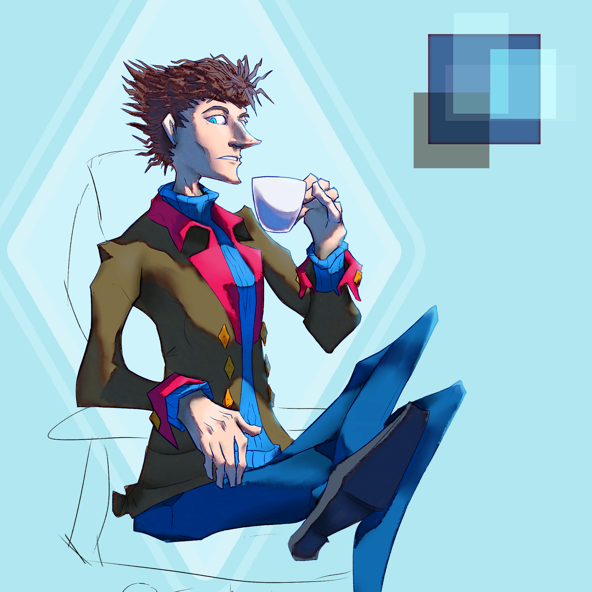

---
humorous:
  - Tumblr Sexyman? ...This is a teacup, not a tumbler.
tags:
  - lighting
  - vicerre
---

# Rendition 023 – Vicerre (2022-09-11 – 2022-09-18)

## Overview

Since I've [updated Vicerre's hair design](2022-08-31_rendition-021_hair.md) and [gained experience in rendering lighting](2022-09-05_rendition-022_three-point-lighting.md), I felt the need to update [my prior reference for him](../2022-h1/2022-06-11_rendition-017_reference.md). This image represents my latest rendition of his design.

## Design notes – shading

<!--
The shape of the light affects the shape of the shadow. This may sound obvious, but it is a principle I only acknowledged passively in prior drawings.
-->

- Brush used: Kyle's Paintbox – Scratch Bristle
- In order to draw shadows analytically, I needed adequate staging in my art setup. While drawing, I found it impossible to maintain consistent shading across the piece without drawing reference light rays and spheres across the canvas.
- In my previous lighting exercise, I used directional lights for simplicity. For this image, I used a spot light instead. With a directional light, the value of lights and shadows always matches the direction of the normal. With any other shape of light, however, the angle at which light strikes a surface affects the shape of the shadow at that point. This change makes for a more challenging, if more expressive lighting setup.
- The most important lesson I've taken away from Sam Nielson's course is the value of normals. By using a shaded sphere as a reference, identifying the value of a surface becomes a matter of matching the direction of its normal the reference sphere's normal. This improves shading consistency in a way eyeballing shadows cannot.
- Analytical shading requires a paradigm shift in my shading workflow. Previously when shading, I would often refer back to the image thumbnail to assess whether my shadows seemed plausible. With this method, my technique is the exact opposite: I want to focus as closely as possible on the immediate region I am shading in to ensure my lights are as accurate as possible.
  - Additionally, when I was shading in this piece, I imagined a sphere at the location of my brush. The shading on this imaginary sphere matches the light rays at that point, and it determines where shadows should land in the canvas's immediate vicinity.
- Aside: I wish I didn't need to treat shading as a science. Art is fun when I can produce something with little effort. When I rely on mathematical rigor, I find that the enjoyment is stripped out. In this case, I feel like I could learn how to render the subject in Blender instead. I digress, though. I enjoyed how the shading turned out, and I learned much from this process.

## Design notes ¬ miscellaneous

- I experimented with art style in this image. Specifically, I placed emphasis on Vicerre's angular features by depicting him with more concave curves than usual.
- I've always wanted to draw Vicerre sitting, but I didn't want to draw a chair. I split the difference here and drew the suggestion of a chair instead of a fully-rendered one.
- I wanted to apply a saturation filter around the edge of my shading layer using the Inner Glow layer effect. It took me the longest time to figure out how to achieve this effect, however; layer effects only modify the source layer, so I cannot apply a saturation blending mode on an Inner Glow layer effect without separating the Inner Glow effect from the base shape it is applied to. Ultimately, I resorted to mapping the base shape to a solid black color and mapped Inner Glow to a solid white color. From there, I could apply this combined result as a Layer Mask on a new layer.
  - Apparently, this is the same technique uses by [BlorengeRhymes](https://twitter.com/webberwithoneb/status/1522756704462532608/photo/1) for his shading.

## Observations

- It took me longer to draw Vicerre's hair than it took to draw the rest of the image.
- Originally, I wanted to draw supporting sketches of Vicerre alongside this image. However, I became frustrated with how cold and distant Vicerre was drawn in this image. I wanted to draw something more lighthearted, so I finished this drawing and opted to move on.
- Through this image, I discovered that Vicerre holds his tea with his little finger extended. It's always fascinating to identify new qualities of one's characters that aren't apparent at first until they are drawn in the act.

## References used

- [Crossed legs](https://www.tutorialspoint.com/positive_body_language/positive_body_language_crossed_legs_etiquettes.htm)
- [Executive chair](https://www.haworth.com/na/en/products/executive/fern-executive.html)

## WIPs

- [1](https://cdn.discordapp.com/attachments/261586968230494219/1018315933997076520/unknown.png)
- [2](https://cdn.discordapp.com/attachments/331457840231219201/1018517033664651325/unknown.png)
- [3](https://cdn.discordapp.com/attachments/261586968230494219/1018579066376433684/unknown.png)
- [4](https://cdn.discordapp.com/attachments/331457840231219201/1018700516953432107/unknown.png)
- [5](https://cdn.discordapp.com/attachments/261586968230494219/1018704585801609376/unknown.png)
- [6](https://cdn.discordapp.com/attachments/331457840231219201/1019814526255898714/unknown.png)
