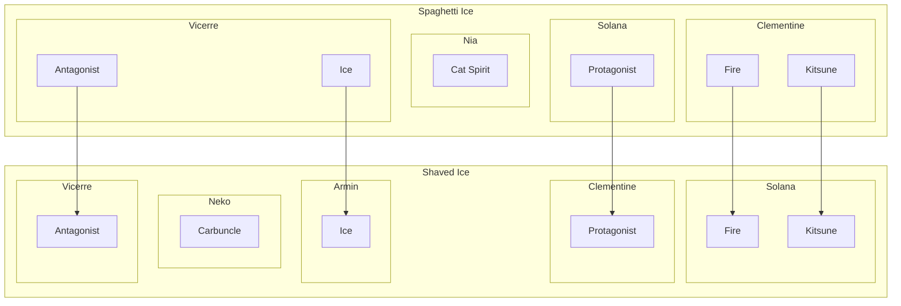

---
tags:
  - alis
  - nekorei
  - nia
  - solana
  - vicerre
---

# Elucidation 014 – Spaghetti Ice → Shaved Ice Character Mapping

## Overview

_Shaved Ice_ adapts the events of _Spaghetti Ice_. However, in doing so, many elements were interchanged, to the point where comparing changes between continuities can be challenging. For this reason, I have laid out a diagram showing these transpositions between continuities as reference.
