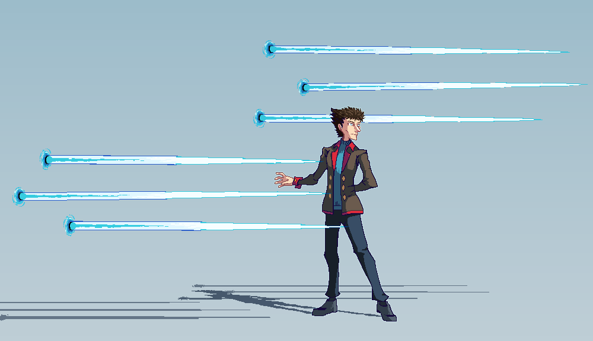

---
tags:
  - concept art
  - fighting game
  - pixel art
  - vicerre
---

# Rendition 024 – Vicerre – Fighting Game Mockup (2022-10-02 – 2022-10-08)

## Overview

In response to [Icebreaker 014](2022-10-01_icebreaker-011-012-013-014.md), several people posted alternate palette schemes for their characters. As this was a fun way to allude to characters' inspirations and similarities, I was inspired to follow along.

However, I lacked any up-to-date pixel art resources for Vicerre that would serve this purpose. Naturally, to solve this issue, I created another sprite of him.

Originally, I intended to draw Vicerre in the style of _Rivals of Aether_. I thought its simple, pixelated style would lend itself well to a quick sprite, which I could then use to produce alternate color palettes.

Unfortunately, I discovered that the _Rivals_ art style was too limited for my purposes. The compactness of the art style made it challenging to design a sprite that included all the features I desired yet evoked personality at the same time. After several attempts, I abandoned this idea.

Instead, I opted for a more traditional size of sprite, taking inspiration from anime fighters such as _Undernight Inbirth_ and _Persona 4 Arena_.

## Design notes

- When I drew this image, I focused on drawing Vicerre first and his ice needles second. This made it challenging to retrofit the needles into the overall composition. If I had outlined the entire composition instead of building on it incrementally, I would have had an easier time finalizing the piece.

## WIPs

- [1](https://cdn.discordapp.com/attachments/1009221988935532634/1026301866386141214/unknown.png)
- [2](https://cdn.discordapp.com/attachments/331457840231219201/1028333616599683122/unknown.png)
- [3](https://cdn.discordapp.com/attachments/331457840231219201/1028488589048295425/unknown.png)
