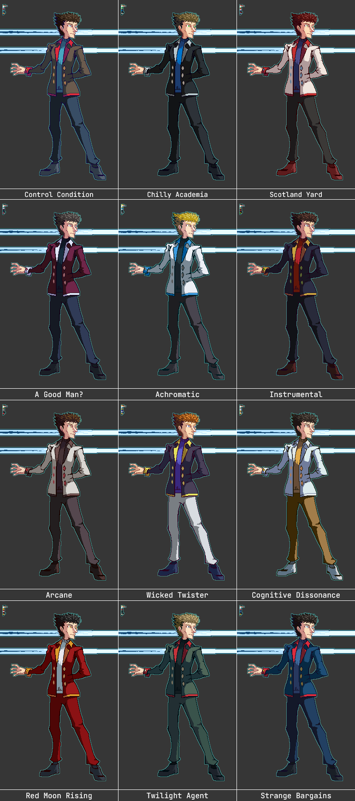

---
humorous:
  - MFW Wicked Twister is actually a roller coaster.
tags:
  - palette swap
  - pixel art
  - vicerre
---

# Rendition 025 – Fighting Game Palettes (2022-10-09)

## Overview

Following [Icebreaker 014](2022-10-01_icebreaker-011-012-013-014.md) and [my subsequent fighting game mockup for Vicerre](2022-10-10_rendition-024_fighting-game-mockup.md), I created a series of color palettes using Vicerre as a base.

These palettes take inspiration from characters with similar tropes to Vicerre, which I will explain below.

## Explanation

| Name                 | Reference                                        | Name Inspiration                                                                                    | Similar Tropes                                    | References Used                                                |
| -------------------- | ------------------------------------------------ | --------------------------------------------------------------------------------------------------- | ------------------------------------------------- | -------------------------------------------------------------- |
| Control Condition    | (default)                                        | controlled experiments + controlling tendencies                                                     |                                                   |
| Chilly Academia      | Vexen (_Kingdom Hearts_ series)                  | Vexen's title, "The Chilly Academic".                                                               | ice, portals, science, visual design              |                                                                |
| Scotland Yard        | Alfendi Layton (_Layton Brothers: Mystery Room_) | Alfendi's work location.                                                                            | brilliant, caustic, two-sided, visual design      |                                                                |
| A Good Man?          | The Twelfth Doctor (_Doctor Who_)                | The Twelfth Doctor's leitmotif.                                                                     | clever, prickly, visual design                    | [1](https://tygerwhocame2t.blogspot.com/p/12th-doctor.html)    |
| Achromatic           | Colress (_Pokémon Black and White 2_)            | His original Japanese name, Achroma, which comes from "achromatic".                                 | ice, morally gray, science                        |
| Instrumental         | Gendo Ikari (_Neon Genesis Evangelion_)          | The name of the project Gendo works on, the Human Instrumentality Project.                          | darkly psychological                              |
| Arcane               | Viktor (_Arcane_)                                | The title of the show.                                                                              | science, visual design                            | [1](https://art-of-arcane.tumblr.com/post/675580523424399360/) |
| Wicked Twister       | Neku Sakuraba (_The World Ends With You_)        | The name of protagonists' group from _NEO: The World Ends With You_.                                | character growth, concave art style, hair style   |                                                                |
| Cognitive Dissonance | Takuto Maruki (_Persona 5 Royal_)                | "Cognition" is a theme in _Persona 5_, and cognitive dissonance plays a role in Maruki's narrative. | antivillain, dream world, research                |                                                                |
| Red Moon Rising      | Ryuusei Cartwright (_AdventureQuest_)            | The red moon of Cartwright's master, The'Galin.                                                     | alternate self, character growth, corruption, ice |                                                                |
| Twilight Agent       | Loid Forger (_Spy × Family_)                     | Loid's codename, Agent Twilight.                                                                    | character growth, intelligent, two-sided          |                                                                |
| Strange Bargains     | Stephen Strange (Marvel Cinematic Universe)      | Strange's surname + "I've come to bargain" + pun on "bargain Strange".                              | clever, morally questionable, portals             |                                                                |

## Scrapped ideas

- Albert Wesker (_Resident Evil_ series): This character is fun, but he is a Hollywood supervillain. In contrast, the other characters referenced are more granular and complex. Additionally, the palette used in his design had overlap with Vexen's palette.
- Spamton (_Deltarune_): Vicerre shares the same head shape and hair style as Spamton, but otherwise, the two characters are not thematically similar enough to warrant an allusion.
- Vlad Stein (_Blood Stain_): While Vicerre and Dr. Stein share tropes, Dr. Stein lacks the moral ambiguity other characters have, which led me to drop it from consideration.

<!--
Alex Mercer?
Deoxys/Esepibe
Lawrence III
Rick Sanchez
The Medic
The Narrator
-->

## Design notes

- Font used: JetBrains Mono
- When designing palettes, I prioritized palettes based on color diversity. Therefore, the characters that had the most striking palettes were the first I designed palettes for.
- If a character had multiple iconic outfits, I used color diversity as a metric to determine which palette to use. For instance, the Twelfth Doctor is best known for his minimalistic black outfit. However, I referenced his red velvet outfit in creating a palette inspired by him, as that was unique. Likewise, instead of Takuto Maruki's regular outfit, I chose his Metaverse one, as it featured gold, which was also unique.
- By default, the palette inspired by Doctor Strange evoked Phoenix Wright instead. To ensure the right reference came across, I fine-tuned the palette such that the values used in it are more deliberate.
- [Darquezze306](https://www.tumblr.com/darquezze306) mentioned that fighting games often include red, green, and blue palette swaps for characters, in order to sort characters into teams. In my initial set of referenced characters, I had no characters that used green in their design, but I thought it was worth adding one. Eventually, using Darquezze's recommendation, I settled for Loid Forger from _Spy × Family_.
- [Darquezze306](https://www.tumblr.com/darquezze306) mentioned that the order of palettes matters in fighting games. Taking this into consideration, I organized my palettes according to a system. For the first eight palettes, I alternated between dark and light palettes, sorting each dark/light palette roughly in order of character similarity to Vicerre. I left the most colorful palettes as my last four palettes.
- I seem to have settled on palette names that provoke intrigue—these titles would make excellent titles for spy thriller novels.

## WIPs

- [1](https://cdn.discordapp.com/attachments/331457840231219201/1028859908256452658/unknown.png)
- [2](https://cdn.discordapp.com/attachments/331457840231219201/1028859908256452658/unknown.png)
