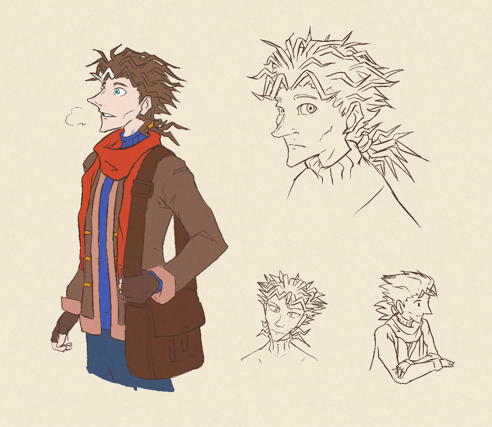
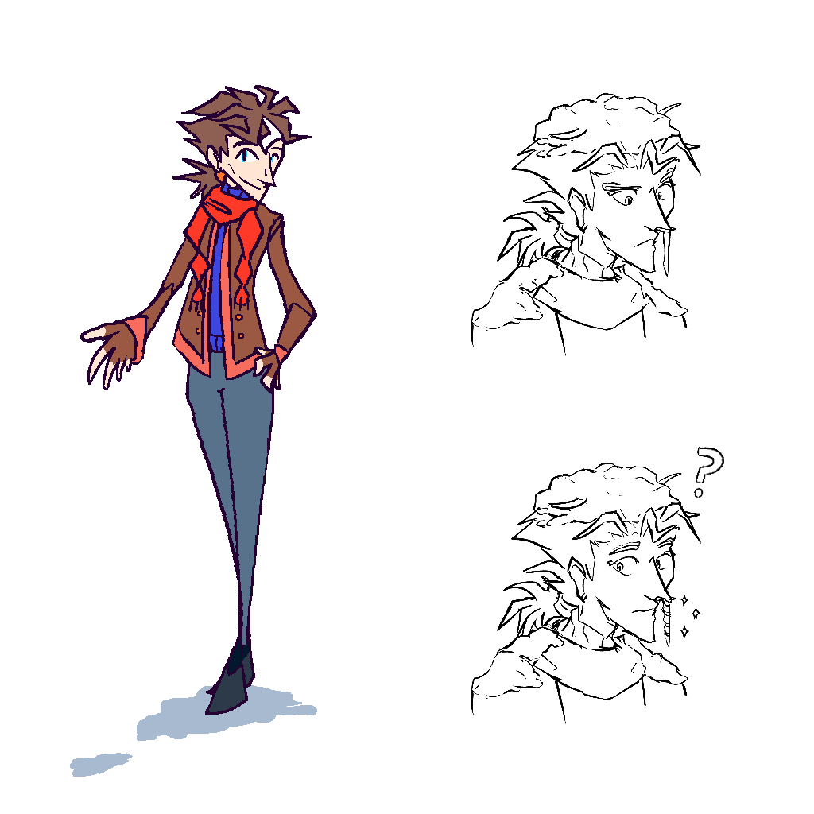

---
humorous:
  - Never go full dere.
tags:
  - character design
  - drill
  - icicle
  - poliosis
  - vicerre
---

# Illustration 009 – Vicerre Character Design Concepts (2022-10-13 – 2022-10-16)

## Overview

[As noted earlier](2022-10-17_meta-007_naming-conventions.md), Vic has evolved to the point where he deserved to have his design updated. This image represents an iteration towards that updated design. I am not completely satisfied with it, however, so I will not consider it finalized.

## Design notes

- Previously, his white irises acted as one defining trait of his character design. In contrast to his previous design, I've inked in his irises in this iteration. This change in his design reflects a change in his demeanor; whereas it was previously near-impossible to gain insight into his true nature, he has since become more accessible. As a bonus, this change to his design has [Daruma doll](https://en.wikipedia.org/wiki/Daruma_doll#Eyes) symbolism, as he has realized one of his goals in-universe.
- Effectively, the scarf around Vic's neck is Solana's. The fact that Vic actively keeps it on him symbolizes two aspects: Vic keeps Solana in mind, and Solana has a hold on him.
- The changes to his hair design reflect Vic's change in mindset. Previously, his hair was pragmatic (if erratic). Now, it is less pragmatic and more romantic (if no less erratic). Additionally, the change to his hair length alludes to [a previous idea I had for his future appearance.](../2021/2021-09-04_rendition-006_future.md)
- In a case of art imitating life, I added a tuft of white hair to his hairline. The tuft plays dual purpose; it acts as a sign of age, and it leans into the classic science fiction horror trope of an unnatural tuft of hair _a la_ _Bride of Frankenstein_.
- His outfit uses a similar color palette as his previous design.
- In my previous design for Vic, his jacket acted as an indicator of how closed-off or open he is to other people. In indoor settings, he is likely to keep his jacket on under normal circumstances. When I started redesigning Vic, I thought he would keep his jacket but wear it more loosely. Imagine my surprise when, instead, his jacket design became _thicker_. As it turns out, making his design fluffier was another way of incorporating softer elements into his design.

## References used

- [business man holding a laptop bag](https://www.shutterstock.com/image-photo/business-man-holding-laptop-bag-95461318)

## WIPs

- [1](https://cdn.discordapp.com/attachments/261586968230494219/1029966822344237066/unknown.png)
- [2](https://cdn.discordapp.com/attachments/331457840231219201/1030254178796306452/unknown.png)

## Bonus sketches (2022-10-18 – 2022-10-19)

