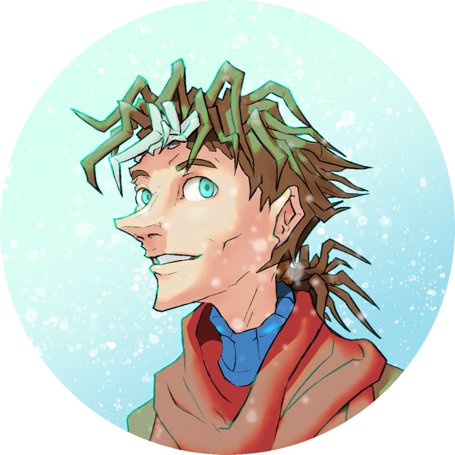

---
tags:
  - portrait
  - vicerre
---

# Rendition 027 – Vicerre Portrait (2022-10-26 – 2022-10-30)

## Overview

[As I recently updated Vicerre's design](2022-10-18_illustration-009_evolved.md), my existing artwork for him became out of date, including my previous portraits of him [1](../2021/2021-07-01_rendition-003_profile-icon.md), [2](2022-07-05_rendition-018_icon.md), [3](2022-07-25_rendition-020_icon.md). To resolve this issue, I drew an updated character portrait.

## Design notes

- Brushes used:
  - Kyle's Inkbox – Brush Beauty 2
  - Kyle's Spatter Brushes – Spatter Bot Tilt
- A character portrait needs to convey the essence of a character through a single image. Three of my four past icons of Vicerre presented him with a serious expression and in unnatural lighting. Considering Vicerre's character development since then, I could not render him with similar features. For this portrait, I instead rendered him with a more relaxed expression and in more natural lighting.
- In contrast to the pale white lighting used in previous portraits, I rendered Vicerre with green-tinted lighting. Green is still a fairly unnatural choice of lighting color, but importantly, it acts as a pivot. In previous portraits, he was rendered in cold, unnatural light, whereas here, the green lighting pulls him in the direction of warm, natural light.

## Inspirations

- [Snowing ❄️](https://koryabeebee.tumblr.com/post/666671972854497280/snowing-spamton-au-by-arrowsperpetualcringe)

## WIPs

- [1](https://cdn.discordapp.com/attachments/331457840231219201/1035030506368159805/unknown.png)
- [2](https://cdn.discordapp.com/attachments/331457840231219201/1035379184689758228/unknown.png)
- [3](https://cdn.discordapp.com/attachments/331457840231219201/1036109991096098886/unknown.png)
- [4](https://cdn.discordapp.com/attachments/1031694106717589544/1036125390160277524/unknown.png)
