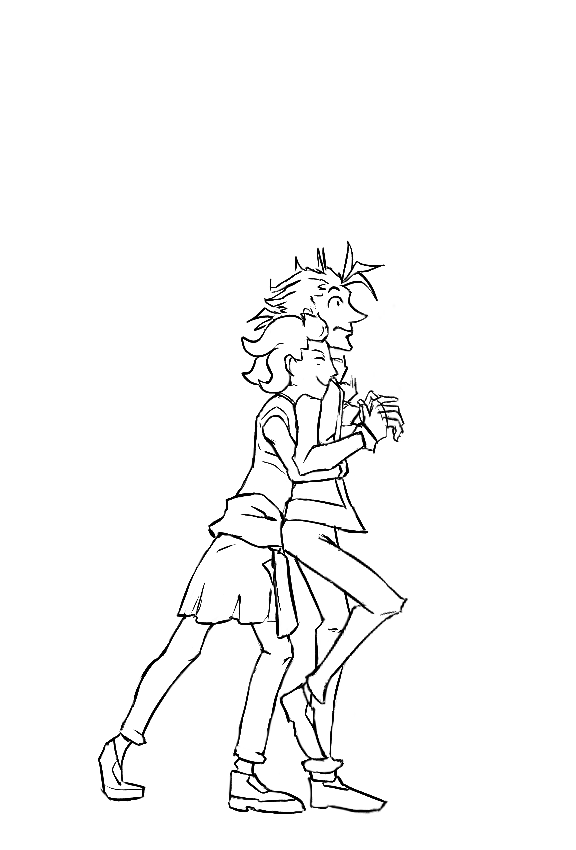
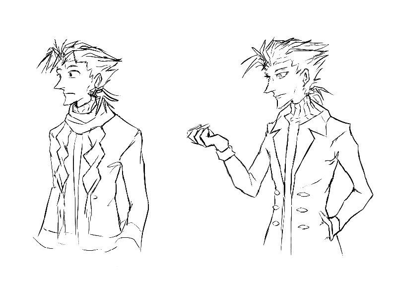

---
tags:
  - alis
  - hug
  - solana
  - vicerre
---

# Illustration 010 – Hug (2022-11-06)

## Overview

Initially, this image acted as an exercise in drawing feet and shoes. From there, I felt the need to draw additional body parts to make sure the feet connected correctly, and from there, the rest of the drawing followed.

I believe this is the first time I have drawn both Solana and Vic full-body in the same image.

# Illustration 011 – Alternate Vic (2022-11-08)

## Overview

A drawing of the other Vic. This image acts as an interesting character design exercise, as the other Vic is physically identical to the original Vic, but his personality is completely different.

## Design notes

- My art style becomes rounder or sharper depending on the character variation drawn.
- Given there is much less visual design space for alternate characters, I need to use body language to signal characterization.
- The default expression on the original Vic seems to be mild confusion now. He's been out of his comfort zone for a while, and he has a lot of catching up to do.
