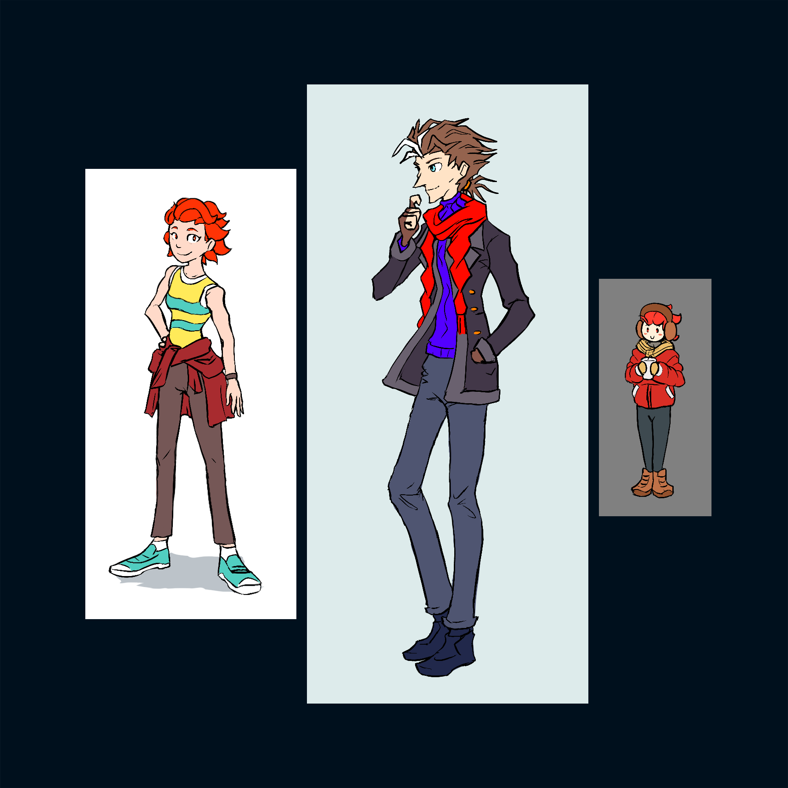

---
tags:
  - black coat
  - costume design
  - solana
  - vicerre
---

# Illustration 012 – Outfits (2022-11-01 – 2022-11-04)

## Overview

I practiced designing alternate outfits for my characters. From left to right, the images depict:

- Solana (2022-11-01)
- Winter Vicerre (2022-11-03)
- Winter Solana (2022-11-04)

## Design notes – Solana

This sketch acts as a full-body reference image for Solana's current design.

Since [her previous full-body reference image](../2021/2021-11-13_illustration-002_solana.md), I've changed the following about her design:

- Hairstyle ([see my post on hair](2022-08-31_rendition-021_hair.md) for more information)
- Shirt style (tee vs. sleeveless top)
- Accessories (extra wristband)

## Design notes – Winter Vicerre

- After spotting a passerby in a stylish black peacoat, I was inspired to draw Vic dressed in black.

## Observations – Winter Vicerre

- Vic's personality seems to balance out his physical appearance. [Previously,](2022-10-18_illustration-009_evolved.md) I commented how Vic's design became more winter-themed despite his icy personality [having defrosted.](https://tvtropes.org/pmwiki/pmwiki.php/Main/DefrostingIceQueen) When I was sketching this image, I noticed how comfortable he was wearing darker colors. Previously, he would not have dressed in black, as he would have been self-conscious of the impressions that would give others. In contrast, Vic would not mind now, as his personality would balance impressions out.
- The turtleneck in this design has a royal blue hue—a richer color than the color used in previous images. Not only does this color match his bright orange-red scarf and black jacket better, but it is also symbolic of his character. Previously, the colors used in his design were diluted. However, as Vic becomes more "complete", those colors increase in saturation.

## Design notes – Winter Solana

- In contrast to Vic, Solana needs to dress warmer than Vic—especially at the extremities. For this reason, she wears earmuffs, mittens, and winter boots.
- Solana has a casual, sporty aesthetic. In this outfit, this aesthetic is reflected in her jacket, leggings, and boots.
