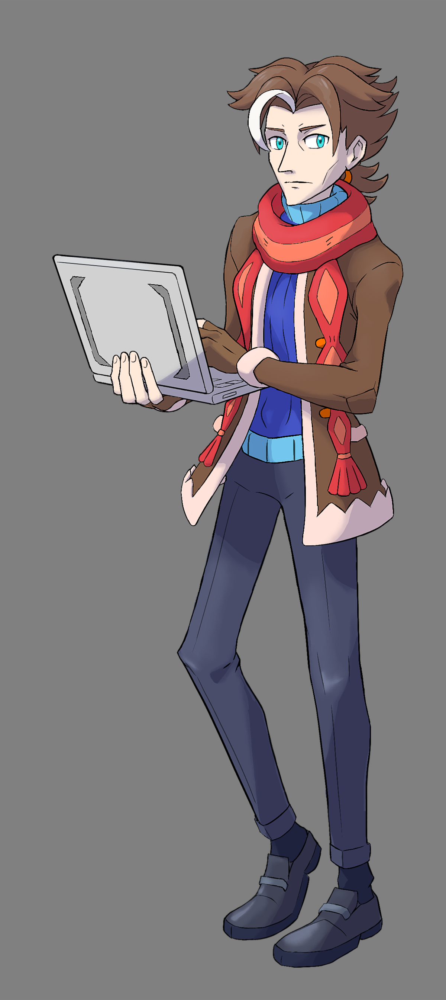

---
humorous:
  - beanpole
tags:
  - pokémon
  - style challenge
  - vicerre
---

# Rendition 028 – Pokémon Art Style Study (2022-11-13 – 2022-11-19, 2022-11-26 – 2022-11-27)

## Overview

Previously, I've drawn Vicerre in [Sunfished's art style](2022-10-25_rendition-026_art-style.md), and in doing so, studied another artist's workflow. As I learned much about my own workflow through this exercise, I sought to repeat this exercise using another artist's style.

Separately, I had browsed TV Tropes. On TV Tropes, I encountered the word "wisteria", a species of tree. I noticed how the phonemes in the word remind me of the phonemes in "Vicerre".

These two factors inspired me.

In _Pokémon_, professor characters are traditionally named after species of trees (Oak, Elm, Birch, etc.). If Vicerre were to translate into the _Pokémon_ universe, he would adapt well using the alias "Professor Wisteria". Thus, I drew Vicerre in the _Pokémon_ art style.

## Design notes

- When drawing a character in a different style, the artist must employ two skills: rendering and designing. Both of these skills are required to make a convincing character design. In drawing Vicerre in the _Pokémon_ art style, I had to consider both factors:
  - Due to a lack of second- and third-level design elements, Vicerre's base design did not mesh with _Pokémon's_ design philosophy. Due to this, I embellished his design with details not seen in his original design.
- The _Pokémon_ art style is deceptively challenging to replicate. The simpler an art style is, the less margin of error you have in making it look accurate:
  - In my native style, I often convert my sketch layer directly into my lineart layer. With this exercise, I instead drew four sketch layers before drawing lineart layers on top. I found this change of workflow to be productive, as I found little need to revise my lineart layers afterward.
- In adapting Vicerre's hairstyle to the _Pokémon_ art style, I drew inspiration from [his previous JRPG adaptation](2022-07-11_rendition-019_jrpg.md).

## Observations

- In contrast to my native art style, characters drawn in the _Pokémon_ art style have larger foreheads and longer legs.
- The final render required 54 layers and 25 groups. This is by far the most number of layers/groups dedicated to a character image to date.

## Workflow

- Brush used: Kyle's Inkbox: Mr. Natural Brush
- Smudge brush used: Sam Nielson Brushes: Smudge Nice
- Highlight layer properties:
  - Blend mode: Overlay
  - Color: #2E2D3F
  - Opacity: 100%
- Shadow layer properties:
  - Blend mode: Multiply
  - Color: #6Ff65A2
  - Opacity: 25%
- Post-processing effects:
  - Filters > Blur
  - Filters > High Pass (1.0 pixels) + Overlay

## References used

- [List of game characters](https://bulbapedia.bulbagarden.net/wiki/List_of_game_characters)
- [Brassius](https://bulbapedia.bulbagarden.net/wiki/Brassius): contours
- [Clavell](https://bulbapedia.bulbagarden.net/wiki/Clavell): cheekbones
- [Colress](https://bulbapedia.bulbagarden.net/wiki/Colress): contours
- [Faba](https://bulbapedia.bulbagarden.net/wiki/Faba): head shape
- [Grimsley](https://bulbapedia.bulbagarden.net/wiki/Grimsley): eyes
- [Grusha](https://bulbapedia.bulbagarden.net/wiki/Grusha): scarf
- [Jacq](https://bulbapedia.bulbagarden.net/wiki/Jacq): clothes
- [Molayne](https://bulbapedia.bulbagarden.net/wiki/Molayne): contours
- [Professor Sycamore](https://bulbapedia.bulbagarden.net/wiki/Professor_Sycamore): body shape, clothes
- [Rei](<https://bulbapedia.bulbagarden.net/wiki/Rei_(game)>): scarf
- [Siebold](https://bulbapedia.bulbagarden.net/wiki/Siebold): shoulders
- [Steven Stone](https://bulbapedia.bulbagarden.net/wiki/Steven_Stone): body shape, hair
- [Wicke](https://bulbapedia.bulbagarden.net/wiki/Wicke): clothes

## Resources used

- [How to tell apart the artists working on official Pokémon art](https://tunnaa-unnaa.tumblr.com/post/162328103349)
- [Sugimori Style Guide 2](https://www.deviantart.com/xous54/art/Sugimori-Style-Guide-2-274367080)
- [Sugi-style tutorial](https://www.deviantart.com/hallm3/art/Sugi-style-tutorial-91765718)

## WIPs

- [1](https://cdn.discordapp.com/attachments/331457840231219201/1041513982009290783/image.png)
- [2](https://cdn.discordapp.com/attachments/1031694106717589544/1041537163231240273/image.png)
- [3](https://cdn.discordapp.com/attachments/1031694106717589544/1046215747933839460/image.png)
