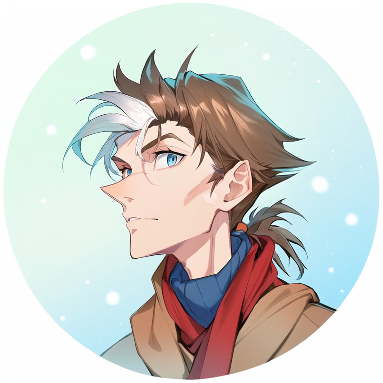

---
humorous:
  - gestaltzerfall
tags:
  - ai art
  - vicerre
---

# Meta 008 – Stable Diffusion Testing



## Overview

[In previous posts, I've expressed interest in the field of machine learning/AI models as applied to art.](https://vicerre.tumblr.com/post/691527556781998080/)

Recently, I've explored this space through the use of the Stable Diffusion model. Having experimented with it, I have further thoughts about this technology.

At its core, text-to-image and image-to-image models offer value as a customizable image search engine. After all, an image speaks a thousand words, and being able to use images in addition to textual keywords personalizes image results in a way traditional engines cannot match.

In particular, the following are areas in which I've found utility:

- Pose references. The ability to sketch a pose and let the model generate a more refined, accurate version of that pose is bounds more natural than searching for a pose through text or creating a pose with a separate tool.
- Design inspiration. Many design elements do not have well-defined names, much less being searchable by those names. Generating designs through images rather than text is faster for translating ideas into images.
- Style. For practicing artists, feeding an unfinished image into a model and receiving a finished image can help identify what else the artist needs to include in the image. It can be quite educational to reverse-engineer finished images.

### I Generated 6000 Images of my Character Using AI

As a stress test for my computer, a friend of mine motivated me to generate 6000 images of Vic. From these generations, we culled the image set to those most accurate to Vic's original design. From there, I edited my favorite image and edited it using a combination of inpainting and manual tools. The image at the start of this post is the result of this process.

## Workflow

- Model: Anything v3 + VAE
- Seed range: `3849441748` - `3849447748`
- Original image: ([1](2022-10-30_rendition-027_portrait.md))
- Batch count: 1000
- Batch size: 6
- Prompt:

```
masterpiece,high quality,best quality,highest detail,4k,((male)),(((high cheekbones))),narrow,thin,long face,pointy,angular,messy hair,((brown hair)),white hair accent,tentatively curious,blue eye,snow,turtleneck,thick winter coat,thick red scarf
Negative prompt: nsfw, lowres, (bad anatomy:1.21), bad hands, text, error, missing fingers, extra digit, fewer digits, cropped, worst quality, low quality, normal quality, jpeg artifacts, signature, watermark, username, blurry, artist name
Steps: 50, Sampler: Euler a, CFG scale: 11, Seed: 3849442642, Size: 768x768, Model hash: 6569e224, Batch size: 6, Batch pos: 0, Denoising strength: 0.5, Mask blur: 4
```

Note: The negative prompt is taken from the [NAI Quick Start Guide](https://rentry.org/nai-speedrun).

## Bonus material

Favorite ordinary generations:

- [1](https://i.imgur.com/AwXGv7N.png) (seed: 324759570)
- [2](https://i.imgur.com/GKydx9l.png) (seed: 3849442642)
- [3](https://i.imgur.com/plw53MF.png) (seed: 3849444997)
- [4](https://i.imgur.com/V3bNv95.png) (seed: 3849447680)

Favorite unusual generations:

- [1](https://cdn.discordapp.com/attachments/1031694106717589544/1057477597526753411/tmp6ch8hkps.png) (seed: 3849444807)
- [2](https://cdn.discordapp.com/attachments/601593408183599109/1057520809528279071/tmplkrqxtfm.png) (seed: 3849447708)
