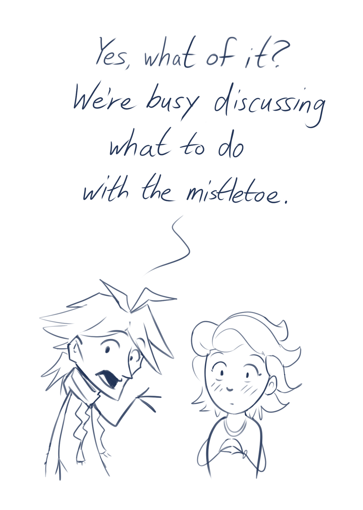

---
tags:
  - alis
  - solana
  - vicerre
---

# Icebreaker 058

> Draw two of your characters being told they're cute while they're in the middle of info-dumping. One of them tries to play it off but gets flustered, and the other goes "shut up I'm talking" and keeps going even harder. ([2023-01-02](https://discord.com/channels/448538687983321098/1020875112045613217/1059420946236178472), [scrumpledorph](https://www.tumblr.com/scrumpledorph), [source](https://cdn.discordapp.com/attachments/1020875112045613217/1059420945925804132/image.png))

([Source](../2022-h2/2022-12-23_vignette-013_holiday-gifts.md))

# Icebreaker 059

> What are your characters getting from the vending machine? ([2022-01-03](https://discord.com/channels/448538687983321098/1020875112045613217/1060024397739589653), [source](https://www.tumblr.com/characterbabble/705481719498850304/))

> Alis: Oreos (he enjoys crosswordese wordplay)
>
> Solana: Doritos (they're tasty, and she finds triangles reminiscent of a certain bioengineer)
>
> Vic: orange juice (they're the only blasted thing in the vending machine that's even vaguely related to fruit)

# Icebreaker 060

> If your characters had to stream themselves playing a video game, what game would they pick, and how would their stream go? ([2023-01-04](https://discord.com/channels/448538687983321098/1020875112045613217/1060253115464556675))

[hypothetical]

> Alis: You would need to convince him that he'll receive funds for his research to get him to "waste valuable time" on games. He borrows Solana's setup to play a few games of online chess with zero commentary.
>
> Solana: Plays mostly cozy games and/or games that feature cute animals. _Pokémon Scarlet_ or _Stardew Valley_ would be such games. Gets sidetracked from sidequests and gushing over cute Pokémon/animals. Is forced to keep the webcam off, since Vic could portal in at any moment with something confidential.
>
> Vic: Claims to be streaming _Animal Crossing_. [Is technically not incorrect.](https://www.tumblr.com/st-ravioli/700455578046201856/)

# Icebreaker 061

> How does this change if they had to produce YouTube videos instead? ([2023-01-05](https://discord.com/channels/448538687983321098/1020875112045613217/1060727654971609180))

[hypothetical]

> Alis: Posts videos of random static to fulfill the prompt without disclosing anything about himself.
>
> Solana: Posts the fantasy universe-equivalent of cat videos.
>
> Vic: Posts mysterious videos that are actually part of an ARG. Said videos fail to gain any traction.

# Icebreaker 062

> What is the hardest part of your characters to draw? ([2023-01-05](https://discord.com/channels/448538687983321098/1020875112045613217/1060713588051947550), [source](https://www.tumblr.com/characterbabble/705635751985053696/))

- Since my art style adapts to the needs of the piece, I do not draw my characters consistently. This makes it a challenge to share character references, as there is no singular way to draw my characters correctly.
- As _Kingdom Hearts_ is a primary inspiration for my characters, my characters' designs follows Tetsuya Nomura's tropes. In particular, this means my characters' hairstyles are awfully elaborate and thus annoying to draw.
- (Inspired by [falgaia](https://falgaia.tumblr.com/):) Cloth physics in general. [Since I've updated Vic's design with a twisted scarf,](../2022-h2/2022-10-18_illustration-009_evolved.md) my ability to render his outfit has worsened.

# Icebreaker 063

> What's going on in your characters' heads most of the time? ([2023-01-07](https://discord.com/channels/448538687983321098/1020875112045613217/1061442666174369932), [source](https://www.tumblr.com/characterbabble/705816951546675200/))

> Alis: Social interaction lookaheads.
>
> Solana: Activities for her companions. Additionally, the opening themes to animes.
>
> Vic: Plans pertaining to his next potential project and/or puzzle.
