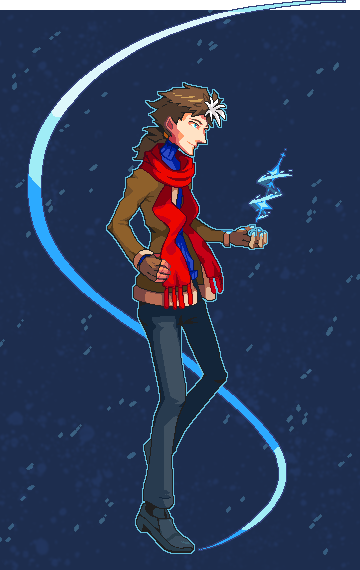

---
humorous:
  - swoosh
tags:
  - pixel art
  - vicerre
---

# Rendition 029 – Vic – Fighting Game Mockup (2023-02-04 – 2023-02-10)



## Overview

[Recently, Vic's personality and design evolved due to events in my universe.](../2022-h2/2022-10-18_illustration-009_evolved.md) As a result, I decided to draw him as a fighting game sprite.

[I've previously drawn a fighting game sprite of Vicerre](../2022-h2/2022-10-10_rendition-024_fighting-game-mockup.md), and afterward, [I created a set of color palettes that reference similar characters from pop culture.](../2022-h2/2022-10-12_rendition-025_fighting-game-palettes.md)

I decided to create another fighting game sprite of Vic for several reasons:

- This prompt gives me a second opportunity to share a set of characters with similarities to Vic.
- I can share the image as a general character reference image.

## Design notes

- Brush used for background texture: Kyle's Inkbox – Spatter Punk

## Observations

- In contrast to his previous characterization, Vic is more receptive to outside influences. This change in characterization is reflected in changes between his previous sprite and the current sprite:
  - Vic's default pose is less stiff. His pose is imbalanced, placing the majority of his weight on a single leg. In addition, his feet aren't planted firmly.
  - The ice he summons manifests itself in curves rather than straight, unbending lines.
  - Likewise, the corners of the image have been rounded off, reflecting his lack of edge.
  - He uses fewer portals in his kit. Instead of avoiding others, he is willing to dance with them.

## References used

- [1](https://twitter.com/shuai_0317/status/1585996022333206530)

Anything V3 prompt:

```
1boy, adult, fighting pose, fullbody, fingerless gloves, ice magic, simple background
Negative prompt: nsfw, lowres, (bad anatomy:1.21), bad hands, text, error, missing fingers, extra digit, fewer digits, cropped, worst quality, low quality, normal quality, jpeg artifacts, signature, watermark, username, blurry, artist name
Steps: 20, Sampler: DDIM, CFG scale: 7, Seed: [random], Size: 512x768, Model hash: 6569e224, Batch size: 6, Batch pos: 1, Denoising strength: 0.6, Mask blur: 4
```

## WIPs

- [1](https://cdn.discordapp.com/attachments/1031694106717589544/1071461607747624980/image.png)
- [2](https://cdn.discordapp.com/attachments/1031694106717589544/1071559384196456449/image.png)
- [3](https://cdn.discordapp.com/attachments/1031694106717589544/1072349548590153758/image.png)
- [4](https://cdn.discordapp.com/attachments/1031694106717589544/1073077191790833725/image.png)
- [5](https://cdn.discordapp.com/attachments/1031694106717589544/1073659907091476520/image.png)
