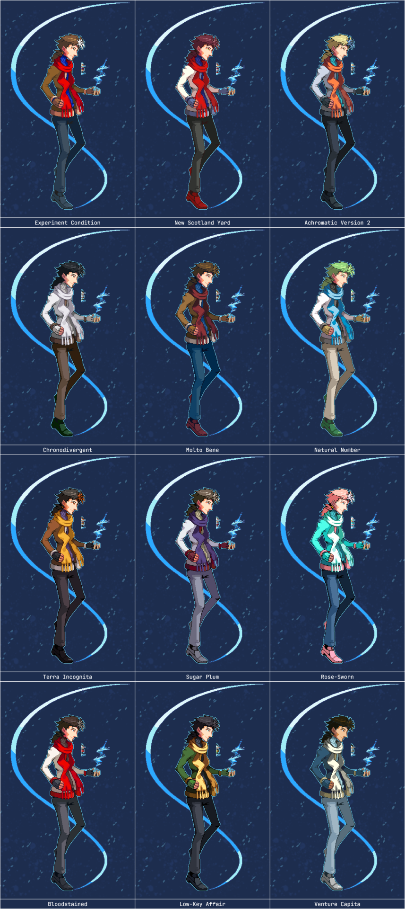

---
tags:
  - palette swap
  - pixel art
  - vicerre
---

# Rendition 030 – Vic – Fighting Game Palettes (2023-02-12)

## Overview

Following [my previous fighting game mockup for Vic](2023-02-11_rendition-029_fighting-game-mockup.md), I created a second set of color palettes using Vic as a base. This image acts as a complement to [my previous set of color palette references.](../2022-h2/2022-10-12_rendition-025_fighting-game-palettes.md)

These palettes take inspiration from characters with similar tropes as Vic, which I will explain below.

## Explanation

| Name                 | Reference                                        | Name Inspiration                                                                                                                                       | Similar Tropes                                                                                                                       | References Used                                                                                                                                                            |
| -------------------- | ------------------------------------------------ | ------------------------------------------------------------------------------------------------------------------------------------------------------ | ------------------------------------------------------------------------------------------------------------------------------------ | -------------------------------------------------------------------------------------------------------------------------------------------------------------------------- |
| Experiment Condition | (default)                                        | Counterpart to "Control Condition" from [the first set of palettes.](../2022-h2/2022-10-12_rendition-025_fighting-game-palettes.md)                    |                                                                                                                                      |                                                                                                                                                                            |
| New Scotland Yard    | Alfendi Layton (_Layton Brothers: Mystery Room_) | Iteration on "Scotland Yard" from the first set of palettes.                                                                                           | brilliant, caustic, two-sided, visual design                                                                                         | [1](https://mysteryroomfiles.tumblr.com/post/109460384222/)                                                                                                                |
| Achromatic Version 2 | Colress (_Pokémon Sun and Moon_)                 | Iteration on "Achromatic" from the first set of palettes.                                                                                              | ice, morally gray, science                                                                                                           | [1](https://bulbapedia.bulbagarden.net/wiki/Colress)                                                                                                                       |
| Chronodivergent      | Rintaro Okabe (_Steins;Gate_)                    | "Chrono-" prefix referring to time, "divergent" referring to the concept of timeline divergence.                                                       | red-haired girlfriend, nerd, science                                                                                                 | [1](https://www.amazon.com/-/dp/B00DTP0KSK)                                                                                                                                |
| Molto Bene           | The Tenth Doctor (_Doctor Who_)                  | One of the Tenth's Doctor's catchphrases.                                                                                                              | eccentric, fashion sense, sci-fi, scruffy                                                                                            | [1](https://merchandise.thedoctorwhosite.co.uk/figurine-collection-magazine-mega-10th-doctor/)                                                                             |
| Natural Number       | N (_Pokémon Black and White_)                    | N's full first name, "Natural".                                                                                                                        | hairstyle, numbers                                                                                                                   | [1](https://bulbapedia.bulbagarden.net/wiki/N)                                                                                                                             |
| Terra Incognita      | Zhongli (_Genshin Impact_)                       | Zhongli's Element, Geo (_terra_), as well as "Rex Incognito", his leitmotif. Also, [_terra incognita_](https://en.wikipedia.org/wiki/Terra_incognita). | brown, combat style, hairstyle, [Weapon of Choice](https://tvtropes.org/pmwiki/pmwiki.php/Main/WeaponOfChoice)                       | [1](https://genshin-impact.fandom.com/wiki/Zhongli/Media)                                                                                                                  |
| Sugar Plum           | Shuu Iwamine (_Hatoful Boyfriend_)               | "Dance of the Sugar Plum Fairy", his leitmotif.                                                                                                        | biology, hairstyle, sinister, virus                                                                                                  | [1](https://hatoful.fandom.com/wiki/Shuu_Iwamine/Gallery), [2](<https://hatoful.fandom.com/wiki/Hatoful_Kareshi_(webcomic)#Chapter_6:_Iwamine_Shuu>)                       |
| Rose-Sworn           | Pearl (_Steven Universe_)                        | Rose Quartz, Pearl's former leader + "Sworn to the Sword", an episode name featuring Pearl. Also sounds like "rose thorn".                             | lithe build, neuroticism, pointy nose, [Weapon of Choice](https://tvtropes.org/pmwiki/pmwiki.php/Main/WeaponOfChoice)                | [1](https://steven-universe.fandom.com/wiki/Pearl/Designs)                                                                                                                 |
| Bloodstained         | Vlad Stein (_Blood Stain_)                       | The title of the webcomic.                                                                                                                             | [Beleaguered Female Assistant](https://tvtropes.org/pmwiki/pmwiki.php/Main/BeleagueredAssistant), pointy nose, nerd, science, skinny | [1](https://twitter.com/lindasejic/status/1233225036573630464), [2](https://sigeel.tumblr.com/post/188731888613/), [3](https://sigeel.tumblr.com/post/615179267487268864/) |
| Low-Key Affair       | Loki Laufeyson (Marvel Cinematic Universe)       | Wordplay on "Loki".                                                                                                                                    | alternate universe variants, ice, moral ambiguity, tricky nature                                                                     | [1](<https://villains.fandom.com/wiki/Loki_Laufeyson_(Marvel_Cinematic_Universe)/Gallery>)                                                                                 |
| Venture Capita       | Varrick (_The Legend of Korra_)                  | Narrative role.                                                                                                                                        | [Beleaguered Female Assistant](https://tvtropes.org/pmwiki/pmwiki.php/Main/BeleagueredAssistant), eccentric, ice, inventive          | [1](https://www.youtube.com/watch?v=mofRHlO1E_A), [2](https://www.youtube.com/watch?v=-cvwVV6REp4)                                                                         |

## Scrapped ideas

- Milo Thatch (_Atlantis: The Lost Empire_): This character has a similar build and role as Vic, but he is too endearing compared to Vic.
- Sweeny Todd (_Sweeney Todd: The Demon Barber of Fleet Street_): This character has a similar appearance to Vic, but he is too macabre for Vic.
- The Medic (_Team Fortress 2_): This character has a similar role and personality to Vic, but he is too absurd compared to Vic.

## Design notes

- Font: JetBrains Mono
- Background color: #1d2d4e
