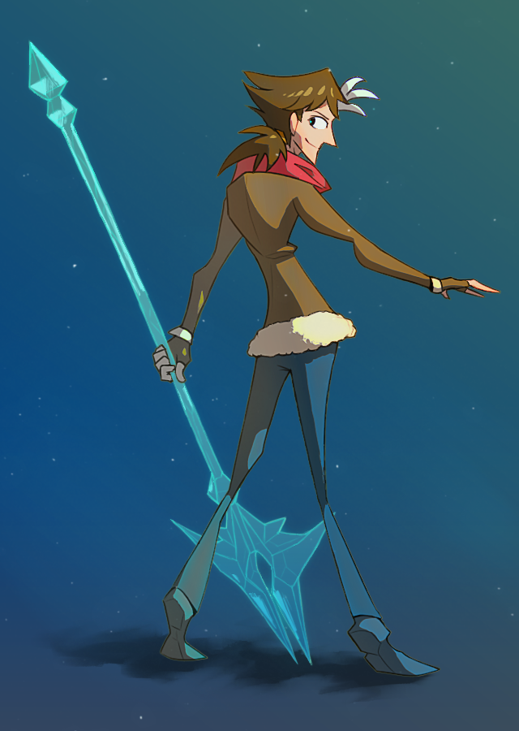

---
humorous:
  - spear
  - mint
tags:
  - bident
  - vicerre
---

# Illustration 016 – Bident (2023-02-18 – 2023-02-20)



## Overview

When drawing characters, I've consistently struggled to draw them in dynamic poses. In the case of Vic, no matter what I tried, I couldn't find a pose that was both dynamic and in-character.

Recently however, I was able to address this issue:

- As explained [by hide channel](https://www.youtube.com/watch?v=WC849fT8xUk), countershapes can be effective at making a composition interesting. For this drawing, I drew on Vic's fondness for long, stabby things and drew him holding a bident made of ice. The bident acts as a prop that provides an appropriate countershape to Vic's own shape.
- The most recent iteration of Vic's design uses diamond shape imagery. As explained [by David Finch](https://www.youtube.com/watch?v=t-crXRMju-Y), diamond shapes are antithetical to dynamic poses. This is because they force the user's attention to converge at points instead of allowing it to flow across the composition. To resolve this issue, I minimized one part of Vic's character design that caused this visual effect (the twisted scarf). In return, I incorporated diamonds into the negative spaces in the image.

Ultimately, while I do not consider this pose impressive, I am happier with it than with previous attempts.

Credit to the following people for feedback:

- [Gravity Monkey](https://twitter.com/GravityMonkey1)
- [moscd](https://moscd.tumblr.com/)
- [the-suniverse](https://www.tumblr.com/the-suniverse)

## Design notes

- Brushes used:
  - Brush > Kyle's FX Brushes – Add Noise
  - Layer > Blending Mode > Linear Burn
  - Layer > Effects > Satin
  - Layer > Effects > Outer Glow > [custom contour with quadratic falloff]
- The image is composed in a way such that the eye travels from the bident's butt to its head, then from Vic's feet to his head. Coincidentally, this forms a V shape.

## Resources used

- [Category: Bidents](https://commons.wikimedia.org/wiki/Category:Bidents)
- [Dust particles](https://www.deviantart.com/wertyfy2/art/853806907)
- [Ice Cometfall](https://forums2.battleon.com/f/tm.asp?m=22308524)
- [IceRazor](https://forums2.battleon.com/f/tm.asp?m=183016)

Stable Diffusion + Anything V3 + VAE + ControlNet prompt:

```
best quality, 1boy facing away, forwards grip, ice blue polearm, brown hair, brown fleece coat, red scarf, official concept art
Negative prompt: nsfw, error, worst quality, low quality, normal quality, jpeg artifacts, signature, watermark, username, blurry, artist name
Steps: 20, Sampler: DDIM, CFG scale: 15, Seed: [assorted], Size: 768x768, Model hash: 8712e20a5d, Denoising strength: 0.5, Mask blur: 4, ControlNet Enabled: True, ControlNet Module: none, ControlNet Model: control_sd15_scribble [fef5e48e], ControlNet Weight: 0.7
```

## WIPs

- [1](https://cdn.discordapp.com/attachments/1020875112045613217/1076641562437615758/image.png)
- [2](https://cdn.discordapp.com/attachments/1020875112045613217/1076717080688214056/image.png)
- [3](https://cdn.discordapp.com/attachments/1020875112045613217/1076984147026923580/image.png)
- [4](https://cdn.discordapp.com/attachments/1020875112045613217/1077045594129969223/image.png)
- [5](https://cdn.discordapp.com/attachments/1031694106717589544/1077340300948815883/image.png)
- [6](https://cdn.discordapp.com/attachments/1020875112045613217/1077364103393321121/tmp2.png)

## Bonus material – Icon


