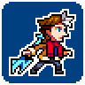

---
tags:
  - animation
  - pixel art
  - rivals of aether
  - vicerre
---

# Rendition 031 – Rivals of Aether Mockup (2023-02-20 – 2023-02-22, 2023-05-02)

## Overview

Around [2022-10-02,](../2022-h2/2022-10-10_rendition-024_fighting-game-mockup.md) I attempted to draw Vic in the style of _Rivals of Aether_. After a brief struggle with the art style, I gave up.

Recently, [the-suniverse](https://www.tumblr.com/the-suniverse) posted an animation of [Sera](https://twitter.com/sunfished/status/1627191205997182976), one of his characters. In this animation, Sera is drawn in the style of _Rivals of Aether_.

This animation inspired me to attempt drawing Vic in the style of _Rivals of Aether_ again. Not only did Sun's sprite act as an invaluable reference, but I had also updated Vic's design since my last attempt.

Taking both factors into account, I was able to create this sprite with minimal difficulty.

Credit to Sun for artistic feedback.

## Design notes

- I made some simplifying changes to fit Vic's core design in a small space:
  - As they would obstruct the sprite's clarity, Vic does not wear gloves.
  - The design of the bident is less elaborate.

## References used

- [Sera](https://cdn.discordapp.com/attachments/1027746329985814688/1077781342558883952/Sera2.gif)
