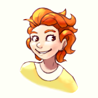
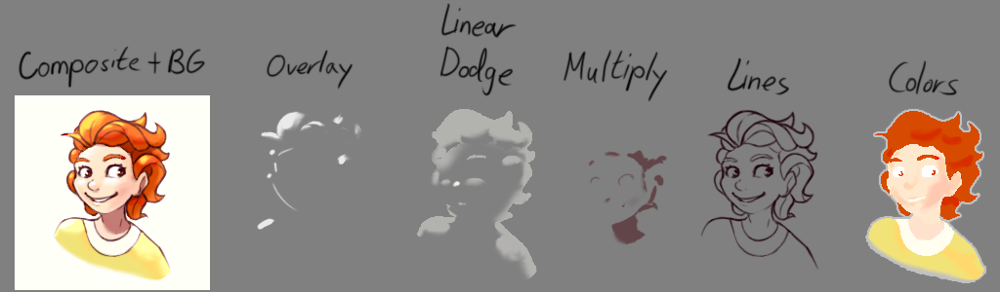

---
tags:
  - icon
  - portrait
  - solana
---

# Rendition 032 – Solana Render (2023-02-23)

## Overview

[sodiclo](https://twitter.com/sodiclo/) is an artist in one of the communities I frequent. I find their illustrations inspiring, as she demonstrates a mastery of shading and composition. Additionally, since we are in the same community, I am able to learn how she draws.

As an answer to one of my questions, sodiclo shared [a YouTube video by YeeJ Chan](https://www.youtube.com/watch?v=MKkzVroMK2E), an artist she finds inspiring. Using this video, I studied this artist's workflow and attempt it myself. As a practice subject, I drew a headshot of Solana.

## Design notes

- The Linear Dodge blending layer, known as the "Add" blend mode in some graphics applications, can be used to add light to a composition. This blending mode seems to work well for tying together elements in a composition.

## Bonus material

