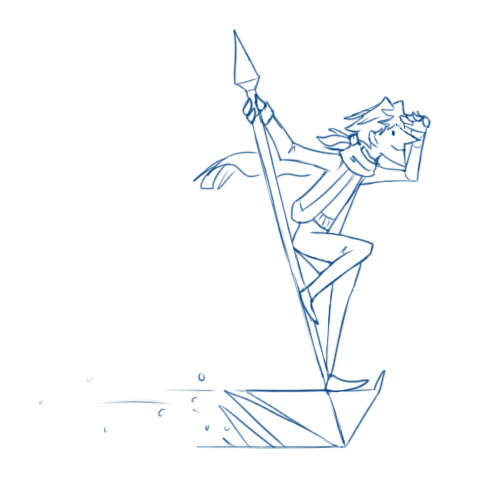

---
humorous:
  - He gives me so much "cat on a roomba" energy.
tags:
  - sketch
  - vicerre
---

# Illustration 017 – Ice Surfing (2023-03-09)

## Overview

One of the delights of having well-defined rules for supernatural abilities in your canon is in realizing how certain interactions plays out when thought about logically.

For instance, consider [Vic's power over ice.](../2021/2021-07-10_elucidation-003_ice-mechanics.md) He can use this ice for a wide range of purposes, such as [to grow icicles](https://vicerre.tumblr.com/post/691245844894203904/) or [to shape weapons](2023-02-20_illustration-016_bident.md). As a corollary both, this means he can fashion himself a transport out of ice and ride on it.
