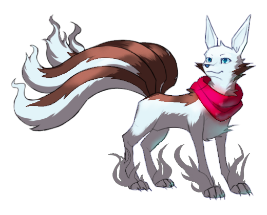

---
humorous:
  - Viennetta
tags:
  - concept art
  - kitsune
---

# Illustration 018 – Kitsune (2023-04-18 – 2023-04-22)

## Overview

Kitsune are one of the many species of supernatural creatures that live in the world of _Spaghetti Ice_. Renowned for their high intelligence and wide array of magical abilities, they make excellent companions for those they respect.

## Design notes

- I've never determined what kitsune look like in my universe. I used Ninetales from _Pokémon_ as shorthand, but I've always wanted to figure out a design of my own eventually. This led to the production of this image.
- Kitsune aren't the highlight of my universe, so I didn't want to belabor on their design. Due to this reason, I only consider this image a concept rather than a definitive design.
- This design was an exercise in balancing contradictions. I wanted to create a design that was lean yet fluffy; and cute yet elegant. For the former, I opted to draw the kitsune's body as lean but include tufts of fur at the extremities. For the latter, I drew the kitsune with Ninetales-like proportions.
- The kitsune's diamond-shaped irises mirror Vic's diamond motif.

## WIPs

- [1](https://cdn.discordapp.com/attachments/1031694106717589544/1098072389457285160/image.png)
- [2](https://cdn.discordapp.com/attachments/1031694106717589544/1099488177263222834/tmp4.png)
- [3](https://cdn.discordapp.com/attachments/1031694106717589544/1099527240808661133/image.png)
- [4](https://cdn.discordapp.com/attachments/607221237449490444/1099825918815510548/image.png)

## Bonus sketches – Other

- [1](https://cdn.discordapp.com/attachments/1031694106717589544/1081009773190852618/image.png)
- [2](https://cdn.discordapp.com/attachments/1031694106717589544/1089371224079093962/image.png)
- [3](https://cdn.discordapp.com/attachments/1031694106717589544/1096993209273553018/image.png)
- [4](https://cdn.discordapp.com/attachments/1031694106717589544/1098400075467718686/image.png)
