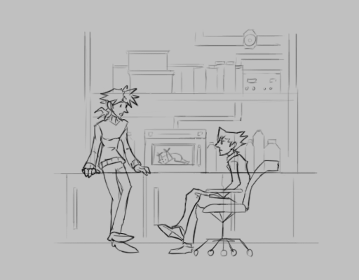

---
tags:
  - alis
  - lab rat
  - sketch
  - vicerre
---

# Illustration 019 – Microwave (2023-04-25 – 2023-04-26)

> "Are you aware you can use microwaves to reanimate small complex organisms? I've asked [Mendel](../2023-q1/2023-01-14_illustration-015_lab-rats.md) to demonstrate."
>
> "...Is this truly a priority over learning genome sequencing, Armin?"

## Overview

After experiencing _Ghost Trick_, I was inspired to draw scenes with my characters. After a brief brainstorm, I drew Vic and Alis having a conversation in the lab.

Originally, I intended for them to be chatting by the supercomputer, but I thought it would be funnier if I drew them by the microwave instead.

## References used

- [1](https://www.google.com/search?q=industrial+microwave&tbm=isch)
- [2](https://www.tumblr.com/neurogenetic/675415537861509120/)
- [3](https://www.youtube.com/watch?v=2tdiKTSdE9Y)
