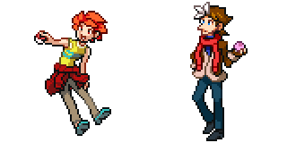

---
tags:
  - pixel art
  - solana
  - sprites
  - vicerre
---

# Rendition 034 – Pokémon Character Sprites (2023-05-04 – 2023-05-06)

## Overview

Some of the people in one of the Discord servers I frequent have been working on a competitive fakemon metagame. Inspired by this project, I asked myself what Pokémon-style pose best shows off my characters' personalities. Eventually, I decided to draw the idea.

## Design notes

- Originally, I thought Solana would strike a cool pose along the lines of [the female Ace Trainer](https://bulbapedia.bulbagarden.net/wiki/File:Spr_DP_Ace_Trainer_F_1.png) from _Diamond and Pearl_. I ultimately drew her in a more casual and fun pose, however, closer to that of the [male Preschooler](https://bulbapedia.bulbagarden.net/wiki/File:Spr_BW_Preschooler_M.png) from _Black and White_. With some feedback from
  [falgaia](https://falgaia.tumblr.com/), [moscd](https://moscd.tumblr.com/), [sodiclo](https://twitter.com/sodiclo), and [the-suniverse](https://www.tumblr.com/the-suniverse), I completed this sprite.
- I could not think of a better pose for Vic than that of [the male Ace Trainer](https://bulbapedia.bulbagarden.net/wiki/File:Spr_BW_Ace_Trainer_M.png) from _Black and White_, so I used it.
- As a nod to later main-series games, I drew Vic using Pokéballs more unique than the ordinary Pokéball. After some consideration, I landed on Dream Balls. Considering his origins in Pokémon role plays, Dream Balls tie into Vic's character concept.

## WIPs

Solana:

- [1](https://cdn.discordapp.com/attachments/1020875112045613217/1103855755033063484/image.png)
- [2](https://cdn.discordapp.com/attachments/1020875112045613217/1104207186252550236/image.png)
- [3](https://cdn.discordapp.com/attachments/1027746329985814688/1104224986832572436/image.png)
- [4](https://cdn.discordapp.com/attachments/1027746329985814688/1104230440384073738/image.png)
- [5](https://cdn.discordapp.com/attachments/1027746329985814688/1104232893540225094/image.png)
- [6](https://cdn.discordapp.com/attachments/1027746329985814688/1104522336515932180/image.png)

Vic:

- [1](https://cdn.discordapp.com/attachments/1031694106717589544/1104530140207272016/image.png)
