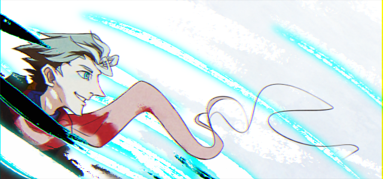

---
tags:
  - vicerre
---

# Rendition 035 – Lighting Test (2023-05-13 – 2023-05-14)

## Overview

Following [a previous lighting test](../2023-q1/2023-02-26_rendition-032_solana-render.md), this image acts as a second exercise in using the Linear Dodge blending mode for illustration.

Ultimately, I could not prevent the colors on the image from looking washed out, so I incorporated these colors into this piece's overall composition.

New brushes used:

- Kyle's Bamboo Stick (ice)
- Kyle's Inkbox – Chopped (body)
- Kyle's Paintbox – Fat Fun Spongy (background)
- Kyle's Paintbox – Impressionist (background)

New post-processing effects used:

- Chromatic aberration

## Resources used

- [1](https://twitter.com/CDReferences/status/1642434691998396416/photo/1)
