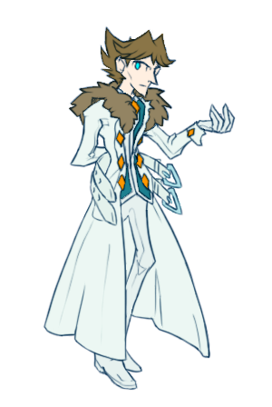

---
tags:
  - alis
  - costume design
---

# Illustration 021 – Alis Updated Design (2023-06-09 – 2023-06-12)

## Overview

When designing a character, I consider a variety of factors, including:

- character personality
- classical design rules (e.g. color balance, memorability)
- design redraw practicality
- story genre/setting
- visual symbolism

I consider character design updates a reactive process; whenever a character undergoes certain events, I am beholden to update their design accordingly.

Recently, Alis has developed significantly as a character. The more he becomes involved with Solana and Vic, the less withdrawn he becomes. For that, I decided he deserved an updated design.

## Design notes

- Since this incarnation of Alis is more approachable yet no less intense, I thought to glean inspiration from [my previous JRPG design for Vic](../2022-h2/2022-07-11_rendition-019_jrpg.md). The bifurcated hair, color palette, and overall clothing design come from here. In contrast to the JRPG design, this outfit has more practical considerations in mind.
- I emphasized radiant white and unpleasant olive, colors associated with Vic's original incarnations that have since been abandoned. These colors were intended to imply divine, yet unnatural imagery. In the design, this is shown through Alis's stark white overcoat and olive-tinted hair and waistcoat. In retrospect, he turned out rather minty-looking instead. This is not a bad thing.
- The orange diamond-shaped buttons from Vicerre's original design have propagated to this iteration.
- The two belts on Alis's longcoat allude to [the four tails kitsune have](2023-04-24_illustration-018_kitsune.md).

## WIPs

- [1](https://cdn.discordapp.com/attachments/1031694106717589544/1116867510281711666/image.png)
- [2](https://cdn.discordapp.com/attachments/1031694106717589544/1117306242042433556/image.png)
- [3](https://cdn.discordapp.com/attachments/1031694106717589544/1117642177883943023/image.png)
- [4](https://cdn.discordapp.com/attachments/1031694106717589544/1118019286112423977/image.png)
