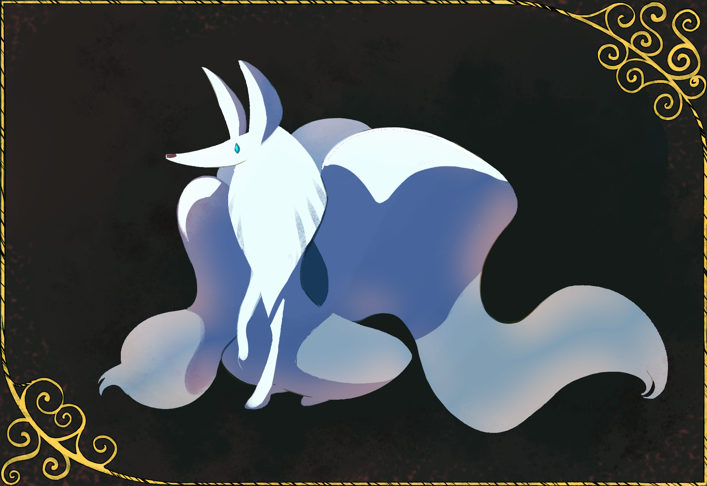

---
tags:
  - kitsune
---

# Rendition 036 – Kitsune (2023-06-25)

## Overview

When I draw, I often get lost in the weeds trying to produce the image. In turn, this slows image production. When [moscd](https://moscd.tumblr.com/) with me, I strongly associated myself with the slow artist.

For this image, I decided to try drawing something looser, focusing on large-scale forms over small-scale detail. Non-human subjects are easier to abstract, so I drew an ice kitsune for this exercise.

## Design notes

- Brushes used:
  - Kyle's Inkbox – Brush Beauty 2
  - Kyle's Paintbox – Encaustic Grit
- Effects used:
  - Layer > Blend Mode > Overlay (texture)
  - Layer > Blend Mode > Soft Light (lighting)
  - Layer > Effects > Satin (back lighting)
