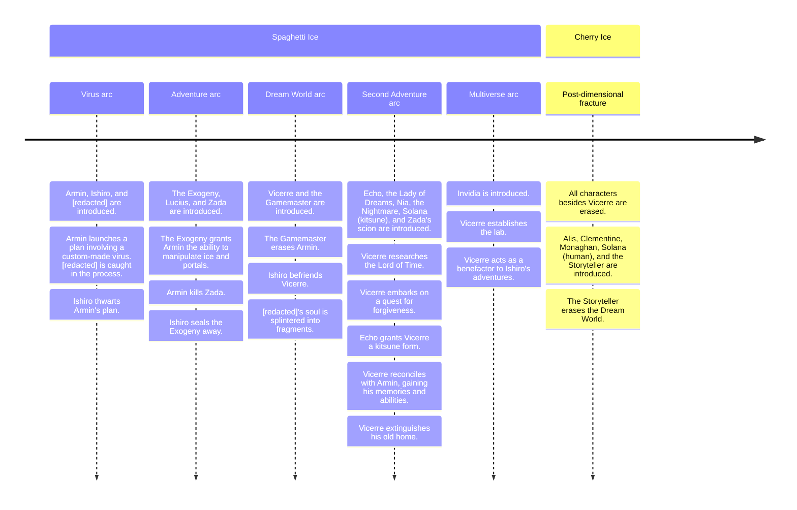

---
tags:
  - timeline
  - vicerre
---

# Elucidation 028 – Timeline

## Overview

Over the course of this blog, I often reference events that have since been lost to the fog of time.

Sometimes, these references are vague to provide intrigue. Other times, however, I genuinely don't remember the details associated with the event, and it's only by writing them out can I reconstruct the order of events.

"Art imitates life," so the saying goes. Like how my narrative contains psychological puzzles, this blog, in some aspect, acts as a meta-puzzle. Whereas Solana must solve puzzles in Alis's Headscape, I must excavate mine.

The diagram in this post provides a 30,000-foot view of the arcs in _Spaghetti Ice_ relative to Vic.

Keep in mind that, throughout each arc, there are a wide variety of events outside the items listed in this timeline.
